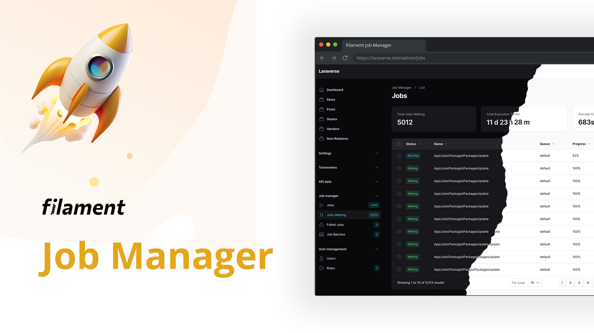
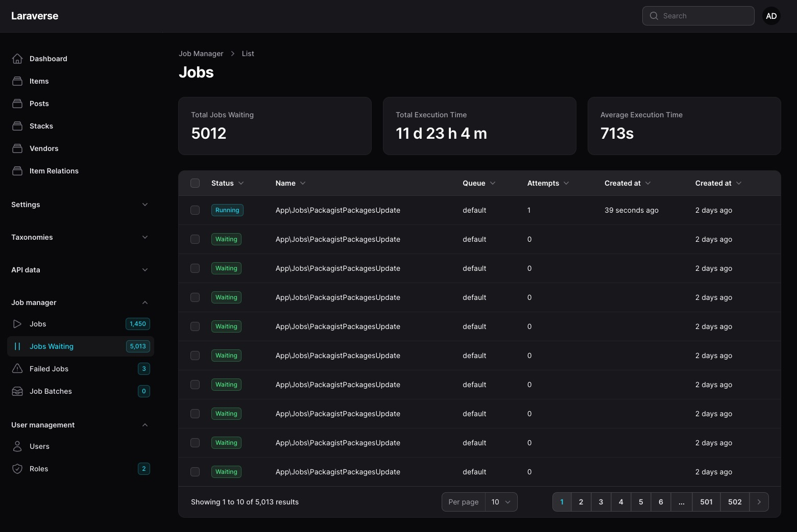
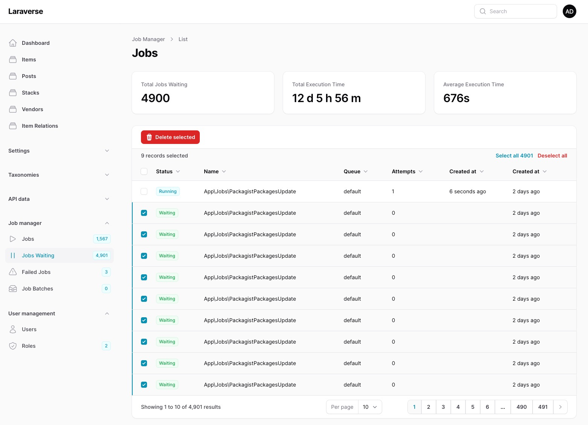
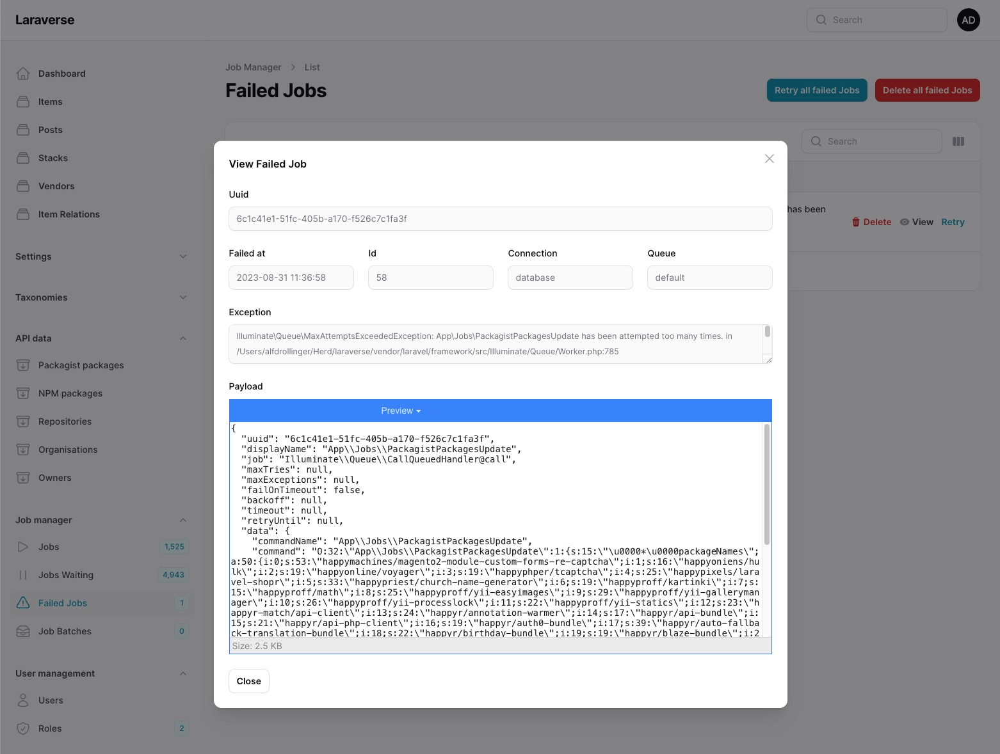
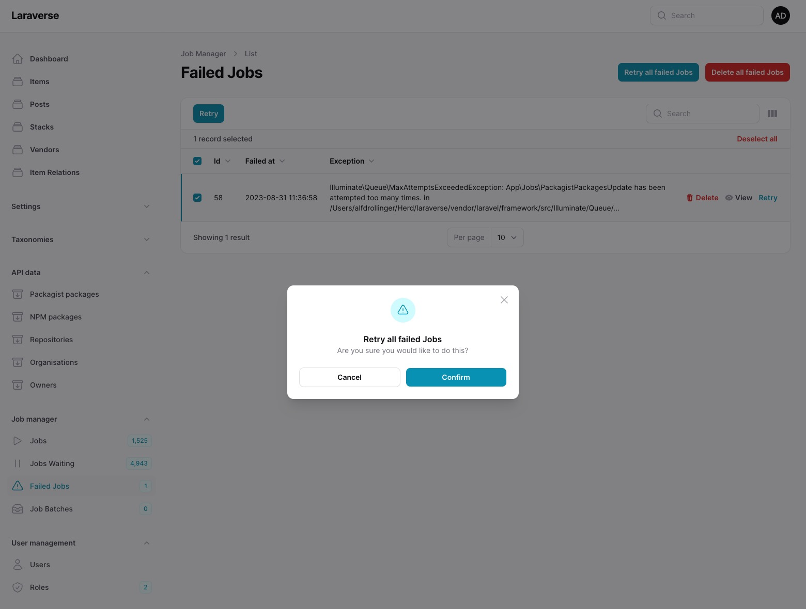
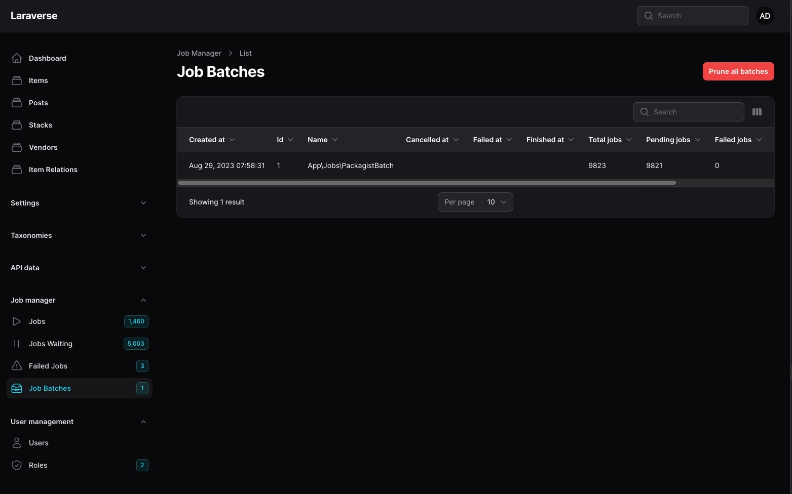

# Filament Job Manager

Filament panel for managing job queues including failed jobs and batches.

## Features

### Jobs

Monitor your running and finished jobs:



This table includes auto-pruning (7 days retention, configurable).

### Jobs waiting

See all waiting Jobs queued, kill one or many:



### Jobs failed

See all failed Jobs including details, retry or delete:





### Job batches

See your job batches, prune batches:



## Installation

This Laravel package is made for Filament 3 and the awesome TALL-Stack.

Install the package via Composer:

```bash
composer require adrolli/jobs
```

Create the necessary tables:

```bash
php artisan vendor:publish --tag="jobs-migrations"

# Queue tables, if using the database driver instead of Redis queue backend
php artisan queue:table
php artisan queue:failed-table
php artisan queue:batches-table

php artisan migrate
```

Publish the config file with:

```bash
php artisan vendor:publish --tag="jobs-config"
```

This is the content of the published config file:

```php
return [
    'resources' => [
        'jobs' => [
            'enabled' => true,
            'label' => 'Job',
            'plural_label' => 'Jobs',
            'navigation_group' => 'Job manager',
            'navigation_icon' => 'heroicon-o-play',
            'navigation_sort' => 1,
            'navigation_count_badge' => true,
            'resource' => Moox\Jobs\Resources\JobsResource::class,
        ],
        'jobs_waiting' => [
            'enabled' => true,
            'label' => 'Job waiting',
            'plural_label' => 'Jobs waiting',
            'navigation_group' => 'Job manager',
            'navigation_icon' => 'heroicon-o-pause',
            'navigation_sort' => 2,
            'navigation_count_badge' => true,
            'resource' => Moox\Jobs\Resources\WaitingJobsResource::class,
        ],
        'failed_jobs' => [
            'enabled' => true,
            'label' => 'Failed Job',
            'plural_label' => 'Failed Jobs',
            'navigation_group' => 'Job manager',
            'navigation_icon' => 'heroicon-o-exclamation-triangle',
            'navigation_sort' => 3,
            'navigation_count_badge' => true,
            'resource' => Moox\Jobs\Resources\FailedJobsResource::class,
        ],
        'job_batches' => [
            'enabled' => true,
            'label' => 'Job Batch',
            'plural_label' => 'Job Batches',
            'navigation_group' => 'Job manager',
            'navigation_icon' => 'heroicon-o-inbox-stack',
            'navigation_sort' => 4,
            'navigation_count_badge' => true,
            'resource' => Moox\Jobs\Resources\JobBatchesResource::class,
        ],
    ],
    'pruning' => [
        'enabled' => true,
        'retention_days' => 7,
    ],
];
```

Register the Plugins in `app/Providers/Filament/AdminPanelProvider.php`:

```php
    ->plugins([
	JobsPlugin::make(),
    JobsWaitingPlugin::make(),
	JobsFailedPlugin::make(),
	JobsBatchesPlugin::make(),
    ])
```

Instead of publishing and modifying the config-file, you can also do all settings in AdminPanelProvider like so:

```php
    ->plugins([
	JobsPlugin::make()
	    ->label('Job runs')
	    ->pluralLabel('Jobs that seems to run')
	    ->enableNavigation(true)
	    ->navigationIcon('heroicon-o-face-smile')
	    ->navigationGroup('My Jobs and Queues')
	    ->navigationSort(5)
	    ->navigationCountBadge(true)
	    ->enablePruning(true)
	    ->pruningRetention(7),
	JobsWaitingPlugin::make()
	    ->label('Job waiting')
	    ->pluralLabel('Jobs waiting in line')
	    ->enableNavigation(true)
	    ->navigationIcon('heroicon-o-calendar')
	    ->navigationGroup('My Jobs and Queues')
	    ->navigationSort(5)
	    ->navigationCountBadge(true)
	JobsFailedPlugin::make()
	    ->label('Job failed')
	    ->pluralLabel('Jobs that failed hard')
	    ->enableNavigation(true)
	    ->navigationIcon('heroicon-o-face-frown')
	    ->navigationGroup('My Jobs and Queues')
	    ->navigationSort(5)
	    ->navigationCountBadge(true)
    ])
```

You don't need to register all Resources. If you don't use Job Batches, you can hide this feature by not registering it, like in this example. The settings of Job Batches is identical to Failed Jobs, if you want to include it with individual settings.

## Usage

Start your queue with `php artisan queue:work`, run a Background Job (use following example, if you need one) and go to the route

-   `/admin/jobs` to see the jobs running and done
-   `/admin/waiting-jobs` to see or delete waiting jobs
-   `/admin/failed-jobs` to see, retry or delete failed jobs
-   `/admin/job-batches` to see job batches, or prune the batch table

## Example Job

You do not need to change anything in your Jobs to work with Filament Job Monitor. But especially for long running jobs you may find this example interesting:

```php
<?php

namespace App\Jobs;

use Moox\Jobs\Traits\JobProgress;
use Illuminate\Bus\Queueable;
use Illuminate\Contracts\Queue\ShouldQueue;
use Illuminate\Foundation\Bus\Dispatchable;
use Illuminate\Queue\InteractsWithQueue;
use Illuminate\Queue\SerializesModels;
use
class JobMonitorDemo implements ShouldQueue
{
    use Dispatchable, InteractsWithQueue, Queueable, SerializesModels, QueueProgress;

    public function __construct()
    {
        //
    }

    public function handle()
    {
        $count = 0;
        $steps = 10;
        $final = 100;

        while ($count < $final) {
            $this->setProgress($count);
            $count = $count + $steps;
          	sleep(10);
        }
    }
}
```

## Authorization

I use Filament Shield instead, so that code is not heavily tested. Please leave a feedback, if you struggle.

If you would like to prevent certain users from accessing your page, you can register a policy:

```php
use App\Policies\JobMonitorPolicy;
use Moox\Jobs\Models\FailedJob;
use Moox\Jobs\Models\JobBatch;
use Moox\Jobs\Models\JobMonitor;

class AuthServiceProvider extends ServiceProvider
{
	protected $policies = [
		JobManager::class => JobManagerPolicy::class,
		FailedJob::class => FailedJobPolicy::class,
		JobBatch::class  => JobBatchPolicy::class,
	];
}
```

```php
namespace App\Policies;

use App\Models\User;
use Illuminate\Auth\Access\HandlesAuthorization;

class FailedJobPolicy
{
	use HandlesAuthorization;

	public function viewAny(User $user): bool
	{
		return $user->can('manage_failed_jobs');
	}
}
```

same for FailedJobPolicy and JobBatchPolicy.

This will prevent the navigation item(s) from being registered.

## Changelog

Please see [CHANGELOG](CHANGELOG.md) for more information on what has changed recently.

## License

The MIT License (MIT). Please see [License File](LICENSE.md) for more information.

## Sponsors

The initial development of this plugin was sponsored by [heco gmbh, Germany](https://heco.de). A huge thank you for investing in Open Source!

If you use this plugin, please consider a small donation to keep this project under maintenance. Especially if it is a commercial project, it is pretty easy to calculate. A few bucks for a developer to build a great product or a hungry developer that produces bugs or - the worst case - needs to abandon the project. Yes, I am happy about every little sunshine in my wallet ;-)

## Credits

This Filament Plugin is heavily inspired (uses concept and / or code) from:

-   https://github.com/croustibat/filament-jobs-monitor
-   https://gitlab.com/amvisor/filament-failed-jobs

Both under MIT License.
A BIG thank you!!!
to the authors.
