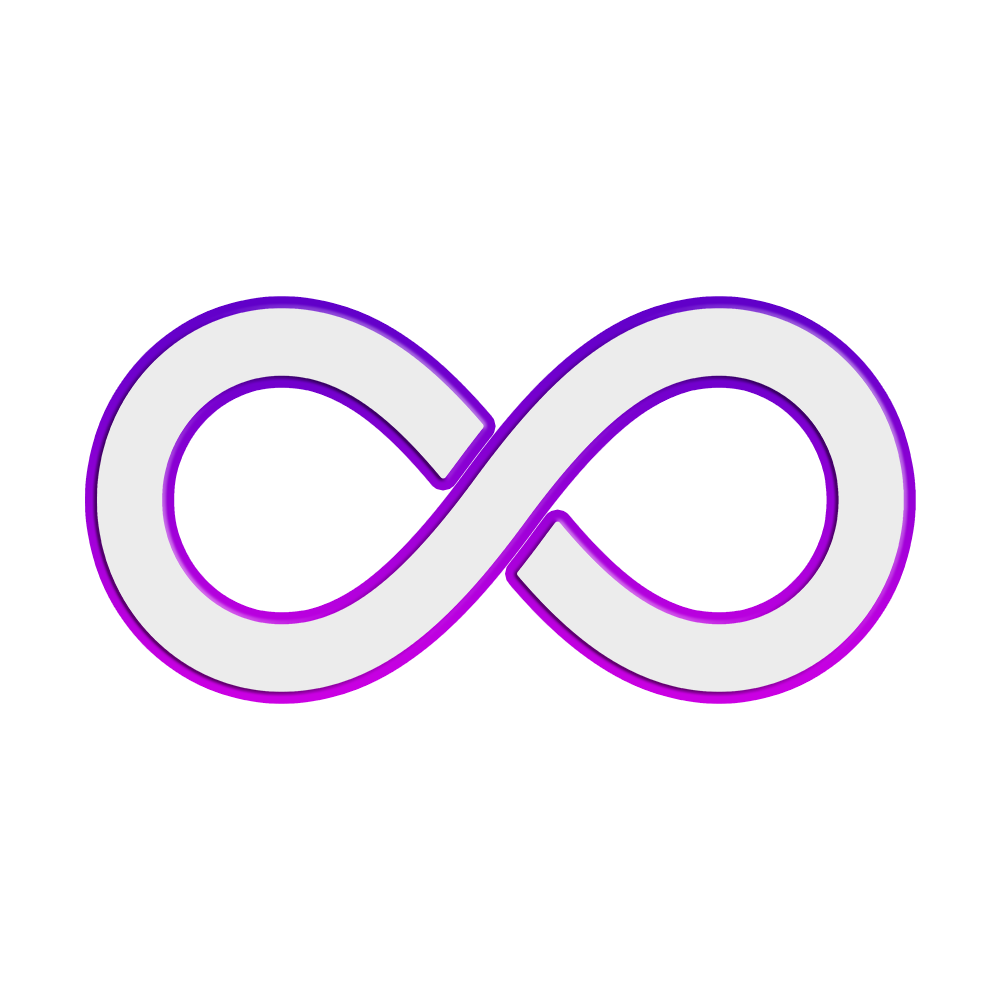

     
  	
     

 

# Moox Art

Moox Art is a Laravel package that also ships every kind of image or blade components to be used on the Moox website, demo or any other Laravel platform that needs Moox branding.

---

## Moox Brand

Welcome to the official Moox brand space — find our logo, signet, banners and information here.

**Moox** is:

-   A short `.org` domain I (Alf) registered 20 years ago to build something awesome

-   Besides **moox.org**, we also own **moox.de**, **moox.pro** and **moox.press**

-   A once-popular TYPO3 extension set, developed by me and my former company DCN

-   A name that works great with tech terms (e.g. _Moox Blog_, _Moox News_, _Moox Builder_)

-   A verb in the making (“Let me moox your website”)

We write **Moox**, not ~~moox~~, not ~~MOOX~~, even if the logo does it wrong ;-)

---

## Moox Logo

Our logo is the infinity symbol — simple, memorable, and hinting at future-proof flexibility.

It looks perfect on dark blue and plays well with bright backgrounds even snow white.

     
    
     

It can loose color (remember fax?) without loosing identity.

     
    
     

_"How does infinity fit Moox? We’ll know in a few decades."_ 😉

---

## Moox Signet

The Moox Signet works on dark and light backgrounds.

     
    
     

We have an alternative version for special purposes.

When used as avatar image, we include the blue gradient background.

Or if you really need a white background.

## Moox Banner

All our packages have a consistent banner — useful for fast visual context.

-   Primary size: **2560×1440**
-   Required by: [filamentphp.com](https://filamentphp.com/)
-   Compatible with: GitHub, Packagist, VS Code, and beyond

     
    
     
     

---

## Moox ASCII Art

For Artisan commands (and others) we use

---

## Moox Screenshots

Our screenshots should use the Moox Screenshot Mockup. Please take care of not leaking private data. We probably use short animated GIF videos instead of static JPEGs.

## Moox Bot

Moox Bot is the identity of our GitHub Bot and he is always around, when browsing Moox.org. He is a nice and helpful robot.

## Moox Colors

We are pink, violet and blue. The Moox Logo and Signet can be

-   white with the pink-violet border around, looks best on dark blue background
-   pink-violet with a white border around, looks best on light backgrounds
-   just black or black bordered, if you need a simplified or colorless version

the colors are:

-   Violet (gradient-mid-tone): #6e15cd
-   Pink (gradient-mid-tone): #860c94
-   Background Dark-blue: #00051b
-   Background Gradient-to: #020a2f

## Moox Fonts

The Moox logo uses **Exo Soft**. On our website and in all admin panels we use **Exo 2**. For long text and printed documentation we use **Noto Sans** and for code we use **Noto Sans Mono**, while all headings should be kept in **Exo 2** or **Exo**. All fonts are available on [Google Fonts](https://fonts.google.com/).
