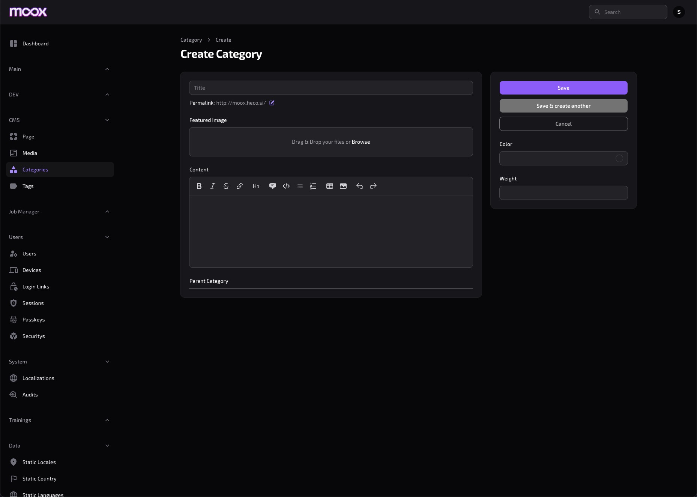
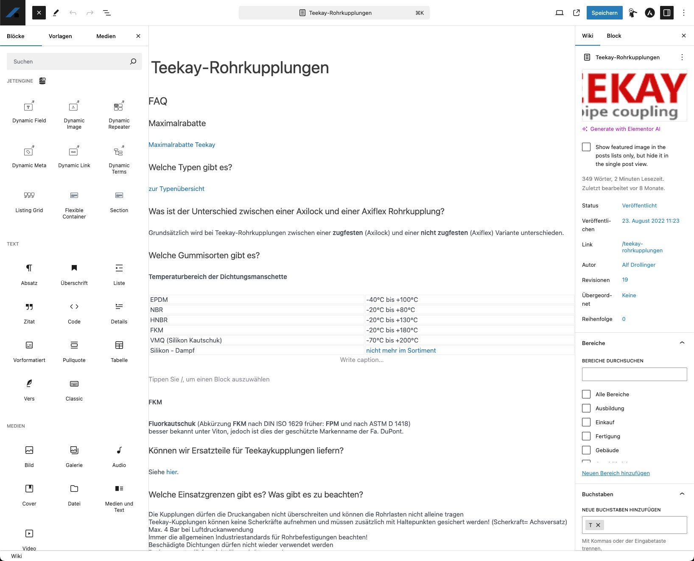

# Moox Block Editor

## Plan B no BlockNote

Nesting seems to be the problem ... decide.
Last state in BlockNote, try to ditch H1, add Mac Shortcuts, probably easier using https://ui.mantine.dev/.

Before switching:

-   Test with Mantine
-   Do H2-H6 with Shortcuts
-   Do all Mac Shortcuts
-   Try a 50/50 column

After failing:

1. SPA (React + TipTap): Slash-Menu custom, Properties-Panel, H2–H6, Row/Column (2–3 Presets), Auto-Save.
2. Mini-Endpoints instead of clunky JSON:API
   • GET /moox/media?search=… → Liste/Select
   • GET /moox/taxonomies?search=…
   • POST /moox/editor/autosave
   • POST /moox/editor/publish
3. Filament-Media-Picker as Overlay/Popup: own Route, Return via postMessage → set URL in TipTap.
4. Two Modes (Web/Mail): two Extension-Sets in same SPA.
5. Export:
   • Web → HTML/JSON directly from TipTap.
   • Mail → Server-Endpoint, TipTap-JSON maps to Maizzle-Markup/Tabellen.

## Plan A using BlockNote

Development of the Moox Block Editor, used for Web and Mail.

Stack:

-   https://www.blocknotejs.org/
-   https://react.dev/
-   https://ui.shadcn.com/ (https://www.radix-ui.com/)
-   https://tiptap.dev/
-   https://prosemirror.net/
-   https://yjs.dev/ for Collaboration
-   https://github.com/maizzle/framework for the Mail Editor

Alternatives:

-   https://github.com/puckeditor/puck - cool, but no block editor
-   https://editorjs.io/ - not as modern and maintained
-   https://yoopta.dev/ - seems a bit akward
-   https://lexical.dev/ - not really a block editor, too
-   https://github.com/VanOns/laraberg and https://github.com/Automattic/isolated-block-editor - the monster, nobody gets that to work outside WP

```bash

npm run dev

```

-   http://localhost:5173/

```bash

npm run build

```

-   https://mooxdev.test/moox/block-editor
-   https://mooxdev.test/moox/mail-editor

## Todo

-   Different available Blocks for Web and Mail, configurable?
-   Context-aware Block tab: wire BlockNote selection and render controls for the selected block.
-   Persist UI: remember sidebar width and open panels.
-   Polish: replace custom tabs/accordion with shadcn primitives for a11y/animation.
-   Title UX: optional slug beneath title (read-only with edit button), like Filament.
-   Shortcuts: Cmd+S to Save; Esc to toggle sidebar.
-   Auto-Save etc.
-   https://laraveljsonapi.io/ OR https://github.com/timacdonald/json-api with the concept of https://filamentphp.com/plugins/rupadana-api-service to generate all default APIs we need like Taxonomies etc.
-   Common JSON:API package, Moox JSON-API or API Generator if that fits the thing
-   JSON:API specially for the Block Editor inside the Block Editor package

## Learn from

Align the design with Filament.



Get most features from Gutenberg.



## Packages

-   Moox Page (or Post, Product ...)
-   Moox Layout
-   Moox Blocks
-   Moox Content
-   Moox Designer ... Frontend Editing und Theme Designer (Pro)

## API Ideas

```php

Route::middleware(['auth', 'can:edit pages'])->group(function () {
  // Editor
    Route::get('/moox/editor/{page}', fn(Page $page) =>
        view('moox::editor', ['page' => $page])
    )->name('moox.editor');
});

Route::prefix('api')->middleware(['auth'])->group(function () {
  // Pages
  Route::get('/page/{page}', [PageCtrl::class, 'show']);
  Route::get('/page/{page}/blocks', [PageCtrl::class, 'blocks']);
  Route::get('/page/{page}/{region}', [PageCtrl::class, 'regionIndex']);
  Route::get('/page/{page}/{region}/{order}', [PageCtrl::class, 'regionShow']);
  Route::post('/page/{page}/{region}', [PageCtrl::class, 'regionStore']);
  Route::patch('/page/{page}/{region}/{order}', [PageCtrl::class, 'regionUpdate']);
  Route::delete('/page/{page}/{region}/{order}', [PageCtrl::class, 'regionDestroy']);

  // Blocks
  Route::get('/block/{block}', [BlockCtrl::class, 'show']);
  Route::patch('/block/{block}', [BlockCtrl::class, 'update']);
  Route::delete('/block/{block}', [BlockCtrl::class, 'destroy']);

  Route::get('/block/{block}/children', [BlockCtrl::class, 'children']);
  Route::post('/block/{block}/children', [BlockCtrl::class, 'childStore']); // expects slot+order
  Route::get('/block/{block}/slot/{slot}/child/{order}', [BlockCtrl::class, 'childShow']);
  Route::patch('/block/{block}/slot/{slot}/child/{order}', [BlockCtrl::class, 'childUpdate']);
  Route::delete('/block/{block}/slot/{slot}/child/{order}', [BlockCtrl::class, 'childDestroy']);

  // Optional D&D Move by ID (clear and explicit)
  Route::patch('/block/{block}/move', [BlockCtrl::class, 'move']);
});

```

so in etwa ...

GET /api/block/456/ = get a block
GET /api/block/456/children = get all children of a block
GET /api/block/456/slot/7/child/2 = get the second child of child 7 (slot)
GET /api/page/123/ = get the whole page 123
GET /api/page/123/blocks = get all blocks of page 123
GET /api/page/123/main/ = get all contents of the main col
GET /api/page/123/main/7/ = get the 7th content of the main col
