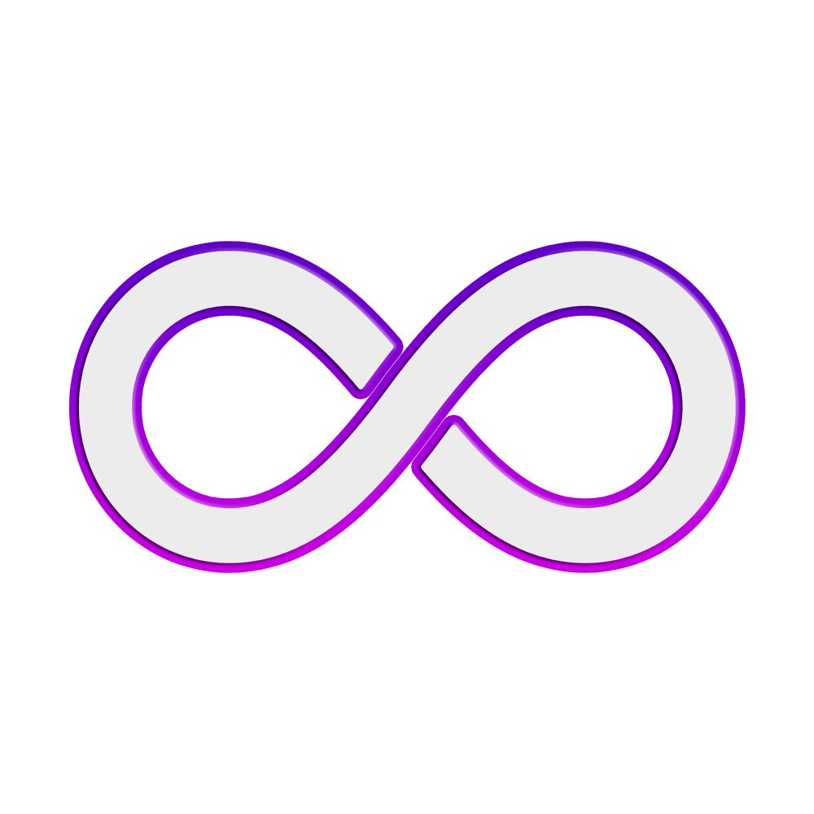
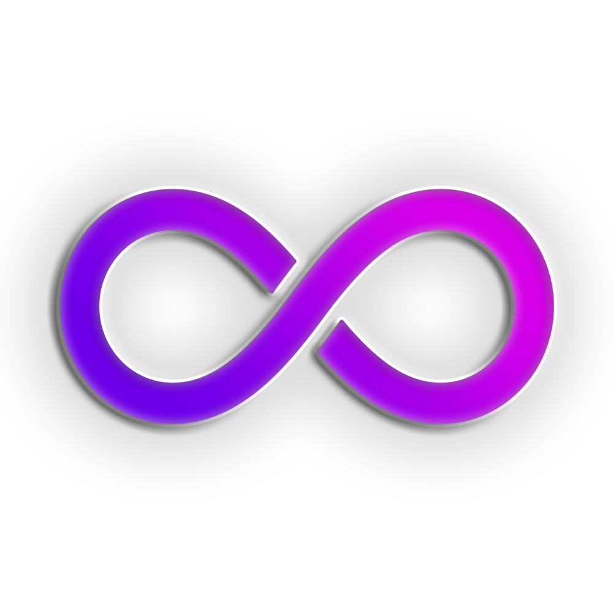
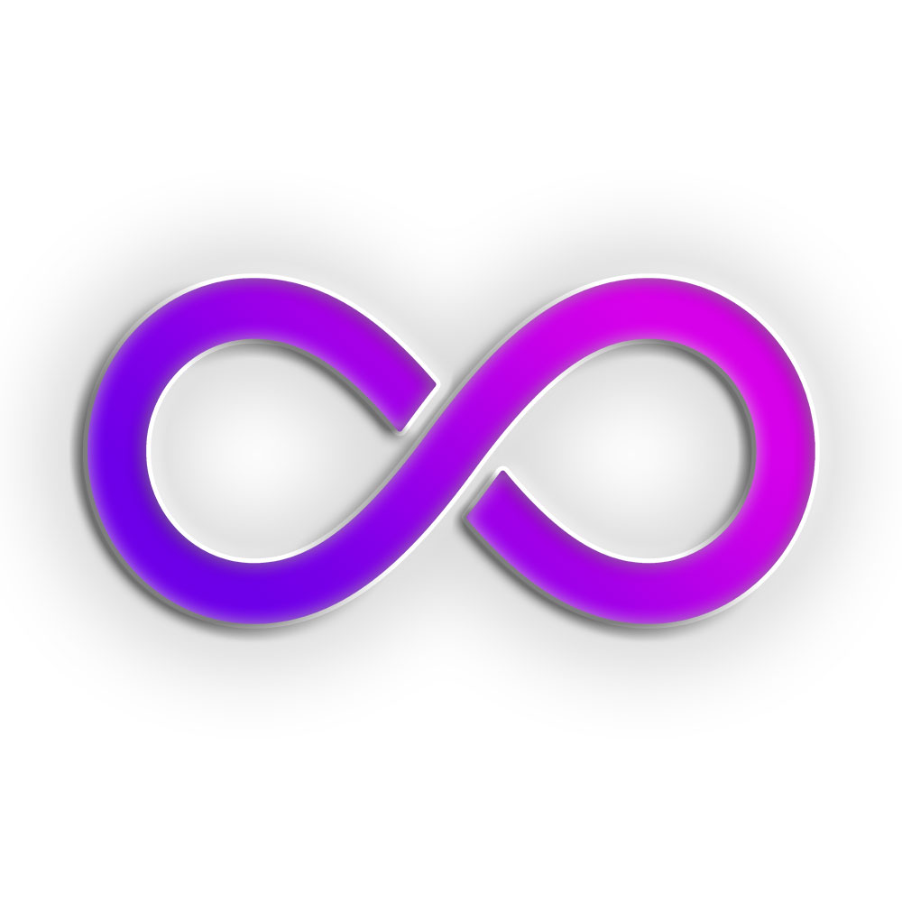

# Moox Brand

Welcome to the official Moox brand package — find our logo, signet, banners and information here.

This is a Laravel package that also ships every kind of image or blade components to be used on the Moox website, demo or any other Laravel platform that needs Moox branding.

## Installation

Coming soon ...

## The Moox Brand

**Moox** is:

-   A short `.org` domain I (Alf) registered 20 years ago to build something awesome

-   Besides **moox.org**, we also own **moox.de**, **moox.pro** and **moox.press**

-   A once-popular TYPO3 extension set, developed by me and my former company DCN

-   A name that works great with tech terms (e.g. _Moox Blog_, _Moox News_, _Moox Builder_)

-   A verb in the making (“Let me moox your website”)

We write **Moox**, not ~~moox~~, not ~~MOOX~~, even if the logo does it wrong ;-)

## Our Moox Logo

Our logo is the infinity symbol — simple, memorable, and hinting at future-proof flexibility.

It looks perfect on dark blue and plays well with bright backgrounds even snow white.

     
    
     
     

It can lose color (remember fax?) without losing its identity.

     
    
     
     

_"How does infinity fit Moox? We’ll know in a few decades."_ 😉

## The Moox Signet

The Moox Signet works on dark and light backgrounds.

     
    
     
     

We have an alternative version for special purposes.

     
    
     
     

When used as avatar image, we include the blue gradient background.

     
    
     
     

Or if you really need a white background.

     
    
     
     

## The Moox Banner

All our packages have a consistent banner — useful for fast visual context.

-   Primary size: **2560×1440**
-   Required by: [filamentphp.com](https://filamentphp.com/)
-   Compatible with: GitHub, Packagist, VS Code, and beyond
-   See the example in this README.md or any other package.

---

## Moox ASCII Art

For Artisan commands (and others) we use ASCII Art ... more coming soon ...

---

## Moox Screenshots

Our screenshots should use the Moox Screenshot Mockup. Please take care of not leaking private data. We probably use short animated GIF videos instead of static JPEGs.

## The Moox Bot

Moox Bot is the identity of our GitHub Bot and he is always around, when browsing Moox.org. He is a nice and helpful robot.

## Our Moox Colors

We haven't defined the colors exactly as we only use them as gradients but those are picked from our logo and banner:

-   **Violet:** #600ab1
-   **Pink:** #860c94
-   **Dark-blue:** #01081b
-   **Gradient-to:** #190fd6

## Our Moox Fonts

- The Moox logo uses **Exo Soft**
- Our website and Admin Panels use **Exo 2**
- For documentation we use **Noto Sans** 
- For code we use **Noto Sans Mono**
- Headings should be kept in **Exo 2** or **Exo** 
- All fonts are available on [Google Fonts](https://fonts.google.com/).

## The Copyright

While most of our packages are FOSS (Free Open Source) and licensed under the permissive MIT license, our identity is protected by Copyright. Please use the package and its contents in a respectful way.

**Copyright 2001 - 2025 Alf Drollinger and the Moox Team**
