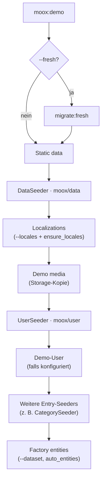

# Seeder mit `moox/demo` — Anleitung

Diese Anleitung beschreibt, wie Moox-Pakete **Eintrags-Seeder** schreiben und registrieren, damit sie von `php artisan moox:demo` ausgeführt werden — und wie sie **ohne** Demo-Paket weiterhin per `db:seed` laufen. Als Referenz dienen die produktiven Implementierungen in **`moox/user`** (`UserSeeder`) und **`moox/category`** (`CategorySeeder`).

---

## Inhaltsverzeichnis

1. [Überblick](#überblick)
2. [Registrierung im Paket](#registrierung-im-paket)
3. [Ablauf von `moox:demo`](#ablauf-von-mooxdemo)
4. [Referenz: `UserSeeder`](#referenz-userseeder-mooxuser)
5. [Referenz: `CategorySeeder`](#referenz-categoryseeder-mooxcategory)
6. [Demo-Integration (API)](#demo-integration-api)
7. [Eigenen Seeder anlegen](#eigenen-seeder-anlegen)
8. [Standalone vs. Demo-Pipeline](#standalone-vs-demo-pipeline)
9. [Konfiguration](#konfiguration)
10. [Fehlersuche](#fehlersuche)

---

## Überblick

| Begriff | Bedeutung |
|--------|-----------|
| **Eintrags-Seeder** | Genau **eine** Seeder-Klasse pro Moox-Paket, die `moox:demo` aufruft (nicht jede `Static*Seeder`-Datei einzeln). |
| **Nested Seeder** | Werden nur von einem Parent aufgerufen (z. B. `StaticLanguageSeeder` durch `DataSeeder`) und erscheinen in `demo.nested_seeder_basenames`. |
| **Dataset** | CLI-Option `--dataset=small\|medium\|large\|huge` — steuert u. a. Zusatzdaten und Factory-Läufe (`demo.dataset_count`). |
| **Demo-Assets** | Optionale Medien aus `packages/demo/resources/demo/assets/` (Avatare, Produktbilder, …), nur wenn `moox/demo` aktiv seedet. |

`moox:demo` führt **keinen** blinden `DatabaseSeeder` über alle Pakete aus. Es ermittelt installierte `moox/*`-Pakete, liest `composer.json` → `extra.moox.install.seed`, sortiert nach Composer-Abhängigkeiten und `config/demo.php` → `seeder_order`, und ruft pro Paket **eine** Klasse auf.

---

## Registrierung im Paket

### 1. Seeder-Klasse und PSR-4

Die Klasse liegt unter `database/seeders/` und wird im `composer.json` des Pakets autoloaded:

```json
"autoload": {
    "psr-4": {
        "Moox\\User\\Database\\Seeders\\": "database/seeders"
    }
}
```

### 2. Eintrag in `extra.moox.install.seed`

**`moox/user`:**

```json
"moox": {
    "install": {
        "seed": "database/seeders/UserSeeder.php"
    }
}
```

**`moox/category`:**

```json
"moox": {
    "install": {
        "seed": "database/seeders/CategorySeeder.php",
        "auto_entities": {
            "Category": true
        }
    }
}
```

- `seed` — Pfad relativ zum Paketroot; daraus wird der Klassenname abgeleitet (`UserSeeder` → `Moox\User\Database\Seeders\UserSeeder`).
- `auto_entities` — betrifft einen **zusätzlichen** Schritt nach den Seedern (Factory-Lauf mit `--dataset`), nicht den Entry-Seeder selbst.

### 3. Paket nicht von der Demo ausschließen

In `config/demo.php` stehen Slugs in `seeder_skip` (z. B. `demo`, `core`), die **nie** automatisch laufen. Eigene Pakete dort nicht eintragen, wenn sie Teil der Demo sein sollen.

### 4. Abhängigkeiten in `composer.json`

`moox/category` verlangt u. a. `moox/localization`. Die Demo sortiert Pakete topologisch: `user` vor `category`, wenn `category` von `user` abhängt (direkt oder transitiv). Zusätzlich kann `seeder_order` die Reihenfolge bei gleicher Tiefe festziehen.

---

## Ablauf von `moox:demo`



Wichtig für eure Seeder:

| Phase | Relevanz für `UserSeeder` / `CategorySeeder` |
|-------|-----------------------------------------------|
| `DataSeeder` | `static_languages`, Länder, Währungen — Voraussetzung für Localizations. |
| Localizations | `CategorySeeder::LOCALES` müssen als `locale_variant` existieren; `ensure_locales` in `demo.php` ergänzt `cs_CZ`, `de_DE`, `en_US`, `pl_PL`. |
| Demo media | Kopiert Dateien aus `resources/demo/media/`; Mediathek-Befüllung für Kategorien kommt oft aus `media`-Tabelle (vorher importieren oder `moox/media` nutzen). |
| `UserSeeder` | Läuft **eigenständig** in der User-Phase (vor den übrigen Paket-Seedern). |
| `CategorySeeder` | Läuft in „Package seeders“, wenn `moox/category` installiert ist — **nach** User und Localizations. |

Während des Laufs setzt `DemoRunner` u. a.:

- `config('demo.runtime.seeding')` → `true`
- `config('demo.runtime.skip_media')` → entspricht `--skip-media`
- `config('demo.dataset_count')` → Wert aus `--dataset`
- `config('demo.media.users_path')` → z. B. `…/demo/resources/demo/assets/images/users`

---

## Referenz: `UserSeeder` (`moox/user`)

Datei: `packages/user/database/seeders/UserSeeder.php`

### Ziele

- Feste Demo-Accounts für Login und Filament-Tests.
- Zusätzliche Benutzer in der Größe des gewählten **Datasets**.
- Optionale **Avatare** aus Demo-Bildern in die Mediathek (`moox/media`).

### Struktur `run()`

Das Muster für alle demo-fähigen Seeder:

```php
public function run(): void
{
    $this->seed();

    if (class_exists(\Moox\Demo\Seeding\RunsMooxDemoAssets::class)) {
        \Moox\Demo\Seeding\RunsMooxDemoAssets::invoke($this);
    }
}
```

- **`seed()`** — Kernlogik; funktioniert auch ohne installiertes `moox/demo`.
- **`RunsMooxDemoAssets::invoke($this)`** — ruft optional `seedDemoAssets()` auf (nur wenn Demo seedet und `--skip-media` nicht gesetzt ist).

### Feste Definitionen: `DEFAULT_USERS`

```php
public const DEFAULT_USERS = [
    ['name' => '…', 'email' => '…', 'password' => '…'],
    // …
];
```

Diese Accounts werden **bei jedem Lauf** neu angelegt (nach `purgeDemoUsers()`). E-Mails mit Domain `@moox.org` und `demo-user-*@moox.org` werden vor dem Seed gelöscht, damit Wiederholungen idempotent bleiben.

### Dataset: Anzahl Zusatz-Benutzer

```php
$extraCount = $this->resolveExtraUserCount();
// …
private function resolveExtraUserCount(): int
{
    $smallDefault = (int) (config('demo.dataset_sizes.small') ?? 100);

    if (class_exists(\Moox\Demo\Seeding\SeedingConfig::class)) {
        return \Moox\Demo\Seeding\SeedingConfig::resolveCount('user', $smallDefault);
    }

    return $smallDefault;
}
```

| Aufruf | Zusatz-User (Beispiel `small` = 100) |
|--------|--------------------------------------|
| `moox:demo` | `3` Standard + `100` → `demo-user-001@moox.org` … |
| `moox:demo --dataset=medium` | `3` + `1000` |
| `db:seed --class=UserSeeder` ohne Demo | `3` + `100` (Fallback `dataset_sizes.small`) |

### Konsolen-Ausgabe mit `SeedOutput`

Wenn `moox:demo` läuft, ist `SeedOutput` an die Demo-Konsole gebunden:

```php
\Moox\Demo\Seeding\SeedOutput::created("User {$email}");
\Moox\Demo\Seeding\SeedOutput::detail('…');
\Moox\Demo\Seeding\SeedOutput::progressBar($extraCount, 'Demo users');
```

Ohne Demo: Fallback auf `$this->command?->info()` — gleicher Seeder, normale Artisan-Ausgabe.

### Demo-Medien: `seedDemoAssets()`

Protected Methode, **nur** über `RunsMooxDemoAssets` aufgerufen:

1. Prüft `ImportDemoMediaToMediathek` und `Media`-Model.
2. Liest Bilder aus `config('demo.media.users_path')` (vom Demo-Runner auf `assets/images/users` gesetzt).
3. Importiert in die Mediathek, verknüpft `media_usables`, setzt `avatar_url` am User.

Ohne `moox/media` oder ohne Bilder im Ordner: Seeder bricht Medien-Schritt still ab (Warnung nur mit Command).

### Abhängigkeiten

| Paket | Zweck |
|-------|--------|
| `moox/core` | Basis |
| `moox/media` | Avatare (optional, aber für `seedDemoAssets` nötig) |

---

## Referenz: `CategorySeeder` (`moox/category`)

Datei: `packages/category/database/seeders/CategorySeeder.php`

### Ziele

- Verschachtelter Kategoriebaum (Nested Set, max. Tiefe 4).
- Vier Locales mit echten Übersetzungstexten (Pumpen-/Gebäudetechnik-Thema).
- Zufällige Übersetzungs-Status (`published`, `draft`, `scheduled`, …).
- Verknüpfung mit **bestehenden** Mediathek-Einträgen (`media_usables`), nicht Upload im Seeder.

### Voraussetzungen (Pflicht)

Vor `CategorySeeder` müssen existieren:

1. **Mindestens ein User** — sonst Abbruch mit Fehlermeldung.
2. **Localizations** für alle `CategorySeeder::LOCALES`:

   ```php
   public const LOCALES = ['cs_CZ', 'en_US', 'de_DE', 'pl_PL'];
   ```

   `moox:demo` legt diese über `ensure_locales` plus `--locales` an.

3. **Optional, empfohlen:** Einträge in `media` (Bilder). Ohne Medien: Warnung, Kategorien ohne Bild.

### Seed-Batch und Wiederholbarkeit

```php
public const SEED_BATCH = 'category_seeder_v1';
```

Jede Kategorie erhält `basedata.seed_batch` und `basedata.seed_index`. So lassen sich Demo-Kategorien in Abfragen filtern. Der Seeder **löscht** alte Demo-Kategorien nicht automatisch — bei erneutem Lauf entstehen zusätzliche Bäume mit gleichem Batch-Namen. Für saubere Tests: DB leeren oder gezielt per `basedata->seed_batch` löschen.

### Anzahl Kategorien

```php
private function resolvedCount(): int
{
    if ($this->count !== null) {
        return max(1, min(5000, $this->count));
    }

    $fromEnv = env('CATEGORY_MOCK_COUNT');
    if ($fromEnv !== null && $fromEnv !== '') {
        return max(1, min(5000, (int) $fromEnv));
    }

    return 100;
}
```

| Steuerung | Beispiel |
|-----------|----------|
| Konstruktor | `new CategorySeeder(count: 250)` (bei manuellem Resolve aus Container) |
| `.env` | `CATEGORY_MOCK_COUNT=500` |
| Standard | `100` |

**Hinweis:** Im Gegensatz zu `UserSeeder` nutzt `CategorySeeder` derzeit **noch nicht** `SeedingConfig::resolveCount()`. `--dataset=medium` bei `moox:demo` erhöht daher die Kategorie-Anzahl **nicht** automatisch — nur User-Extras und Factory-Entities. Für gleiches Verhalten wie beim User-Seeder kann `resolvedCount()` analog `SeedingConfig` anbinden (siehe [Eigenen Seeder anlegen](#eigenen-seeder-anlegen)).

### Datenmodell (Kurz)

- **Baum:** `buildParentIndexMap($total)` verteilt Kinder auf Wurzeln aus `ROOT_LABELS_EN`.
- **Übersetzungen:** pro Locale `title`, `slug`, `permalink`, `description`, `content`, `translation_status`, `author_id`.
- **Medien:** `AttachExistingMedia::attach($category, $media, 'image', 'en_US')` mit Wahrscheinlichkeit 85 %, wenn Bilder in der DB sind.
- Abschluss: `Category::fixTree()` und Aktualisierung von `count` (Kinderzahl).

### `run()`-Muster

Identisch zu `UserSeeder`: zuerst `seed()`, dann optional `RunsMooxDemoAssets`. `CategorySeeder` definiert aktuell **kein** `seedDemoAssets()` — der zweite Schritt ist ein No-Op.

### Abhängigkeiten

| Paket | Zweck |
|-------|--------|
| `moox/core` | Draft/Translation-Basisklassen |
| `moox/localization` | `Localization`-Model |
| `moox/user` | Autor der Übersetzungen |
| `moox/media` | `media` / `media_usables` (empfohlen) |

---

## Demo-Integration (API)

Alle Klassen liegen unter `Moox\Demo\Seeding\` und sind **weich** gekoppelt: `class_exists()` im Paket-Seeder, kein harter `require` von `moox/demo` in `composer.json` des Fachpakets.

### `RunsMooxDemoAssets`

```php
RunsMooxDemoAssets::invoke($this);
```

Ruft `protected function seedDemoAssets(): void` auf, wenn:

- `config('demo.runtime.seeding') === true`
- `config('demo.runtime.skip_media') !== true`
- die Methode existiert

### `DemoAssetGate`

```php
DemoAssetGate::enabled(); // seeding && !skip_media
```

### `SeedingConfig`

```php
SeedingConfig::resolveCount('user', $default);
```

Liefert `config('demo.dataset_count')`, wenn Demo seedet — sonst `$default`. Slug-Parameter ist für spätere per-Paket-Overrides vorgesehen; aktuell global ein Wert.

### `SeedOutput`

Nur während `moox:demo` gebunden. In eigenen Seedern:

```php
private function hasSeedOutput(): bool
{
    return class_exists(\Moox\Demo\Seeding\SeedOutput::class)
        && \Moox\Demo\Seeding\SeedOutput::isBound();
}
```

### `ImportDemoMediaToMediathek`

- `listImagePaths($dir, $limit)` — sortierte JPG/PNG/WebP-Liste
- `importFromPath($path, $collectionId)` — Dedupe per SHA-256 in `custom_properties.file_hash`
- `avatarUrlFromMedia($media)` — JSON für `User.avatar_url`

---

## Eigenen Seeder anlegen

Checkliste am Beispiel eines fiktiven Pakets `moox/shop`:

### 1. Klasse erstellen

`packages/shop/database/seeders/ShopSeeder.php`

```php
namespace Moox\Shop\Database\Seeders;

use Illuminate\Database\Seeder;

class ShopSeeder extends Seeder
{
    public function run(): void
    {
        $this->seed();

        if (class_exists(\Moox\Demo\Seeding\RunsMooxDemoAssets::class)) {
            \Moox\Demo\Seeding\RunsMooxDemoAssets::invoke($this);
        }
    }

    protected function seed(): void
    {
        $count = 10;

        if (class_exists(\Moox\Demo\Seeding\SeedingConfig::class)) {
            $count = \Moox\Demo\Seeding\SeedingConfig::resolveCount(
                'shop',
                (int) config('demo.dataset_sizes.small', 100)
            );
        }

        // … idempotente Logik, Abhängigkeiten prüfen …
    }

    protected function seedDemoAssets(): void
    {
        // Optional: Medien aus config('demo.media.products_path') o. ä.
    }
}
```

### 2. `composer.json` registrieren

```json
"extra": {
    "moox": {
        "install": {
            "seed": "database/seeders/ShopSeeder.php"
        }
    }
}
```

### 3. `config/demo.php` anpassen (Host-App)

```php
'seeder_order' => [
    // …
    'category',
    'shop',  // nach category, wenn shop von category abhängt
],
```

### 4. Voraussetzungen dokumentieren und prüfen

Wie `CategorySeeder`: früh `return` mit `$this->command?->error('…')`, wenn Tabellen oder Fremddaten fehlen.

### 5. Konstanten für Demo-Daten

| Muster (`UserSeeder`) | Muster (`CategorySeeder`) |
|----------------------|---------------------------|
| `DEFAULT_USERS` — feste Datensätze | `LOCALES`, `ROOT_LABELS_EN`, Katalog-Methoden |
| `purgeDemoUsers()` — idempotent | `SEED_BATCH` in `basedata` — filterbar |
| Domain-Konstante `DEMO_EMAIL_DOMAIN` | `SEED_BATCH` für Auswertungen |

### 6. Keine harte Abhängigkeit auf `moox/demo`

Fachpakete bleiben in `composer.json` ohne `moox/demo`. Nur optionale `class_exists`-Aufrufe.

---

## Standalone vs. Demo-Pipeline

### Nur Demo-Pipeline (empfohlen für lokale Moox-App)

```bash
php artisan moox:demo
php artisan moox:demo --locales=de_DE,en_US,cs_CZ,pl_PL --dataset=small
php artisan moox:demo --fresh --dataset=medium
php artisan moox:demo --skip-factories --skip-media
php artisan moox:demo --skip-seeders   # nur Static + Localization + Factories
```

### Einzelne Seeder (Debugging)

```bash
php artisan db:seed --class=Moox\\User\\Database\\Seeders\\UserSeeder --force
php artisan db:seed --class=Moox\\Category\\Database\\Seeders\\CategorySeeder --force
```

Reihenfolge manuell einhalten:

1. `DataSeeder` (oder `moox:demo` bis nach Static data)
2. Localizations (`cs_CZ`, `en_US`, `de_DE`, `pl_PL` für Category)
3. Optional Mediathek befüllen
4. `UserSeeder`
5. `CategorySeeder`

Mit `CATEGORY_MOCK_COUNT=50` in `.env` oder angepasstem Konstruktor die Kategoriezahl steuern.

---

## Konfiguration

Nach `php artisan vendor:publish --tag=demo-config` in der Host-App:

| Schlüssel | Wirkung auf Seeder |
|-----------|-------------------|
| `dataset_sizes` | Grenzen für `SeedingConfig` / Factory |
| `ensure_locales` | Wird mit CLI-Locales gemerged — **wichtig für CategorySeeder** |
| `seeder_order` | Priorität bei topological sort |
| `seeder_skip` | Paket-Slug wird übersprungen |
| `nested_seeder_basenames` | Nur Parent-Seeder (z. B. `DataSeeder`) |
| `demo_user` | Zusätzlicher User in Demo-Phase (zusätzlich zu `UserSeeder`) |
| `media.users_path` | Avatare für `UserSeeder::seedDemoAssets` |
| `media.disk` / `media.directory` | Storage-Kopie in `DemoMediaStep` |

Runtime (nur während `moox:demo`, nicht in Config-Datei publiziert):

- `demo.runtime.seeding`
- `demo.runtime.skip_media`
- `demo.dataset_count`

---

## Fehlersuche

| Symptom | Ursache | Maßnahme |
|---------|---------|----------|
| Paket-Seeder wird nicht ausgeführt | Nicht installiert, in `seeder_skip`, oder kein `extra.moox.install.seed` | `composer require`, `composer.json` prüfen |
| `CategorySeeder`: No user found | `UserSeeder` nicht gelaufen | `moox:demo` komplett oder zuerst `UserSeeder` |
| Missing `localizations` rows | Locales fehlen | `moox:demo` mit `ensure_locales` oder LocalizationSeeder |
| Kategorien ohne Bilder | Leere `media`-Tabelle | Mediathek befüllen oder Demo-Medien importieren |
| Avatare fehlen | `--skip-media`, kein `moox/media`, leerer `users_path` | Option weglassen, Media-Paket, Bilder unter `assets/images/users` |
| Zu viele/wenige User | Dataset | `--dataset=`; standalone: Default 100 Extras |
| Zu viele/wenige Kategorien | Kein Dataset-Bezug | `CATEGORY_MOCK_COUNT` oder Konstruktor; ggf. `SeedingConfig` nachrüsten |
| Seeder-Klasse not found | Falscher Namespace / Autoload | PSR-4 in `composer.json`, `composer dump-autoload` |

---

## Kurzvergleich der Referenz-Seeder

| Aspekt | `UserSeeder` | `CategorySeeder` |
|--------|--------------|------------------|
| Registrierung | `extra.moox.install.seed` | gleich |
| Dataset-Anbindung | `SeedingConfig::resolveCount()` | `env` / Konstruktor, Default 100 |
| Idempotenz | `purgeDemoUsers()` | Kein automatisches Purge |
| Demo-Medien | `seedDemoAssets()` (Avatare) | nutzt vorhandene `media`-Zeilen |
| Locales | — | feste `LOCALES` (4) |
| `RunsMooxDemoAssets` | ja | ja (ohne `seedDemoAssets`) |

---

## Weiterführend

- [README des Demo-Pakets](../README.md) — Installation, CLI-Optionen, Medienordner
- [MEDIA_SOURCES.md](../resources/demo/assets/MEDIA_SOURCES.md) — Lizenzen der Demo-Assets
- `php artisan moox:demo -vv` — ausführliche Reihenfolge und übersprungene Schritte
