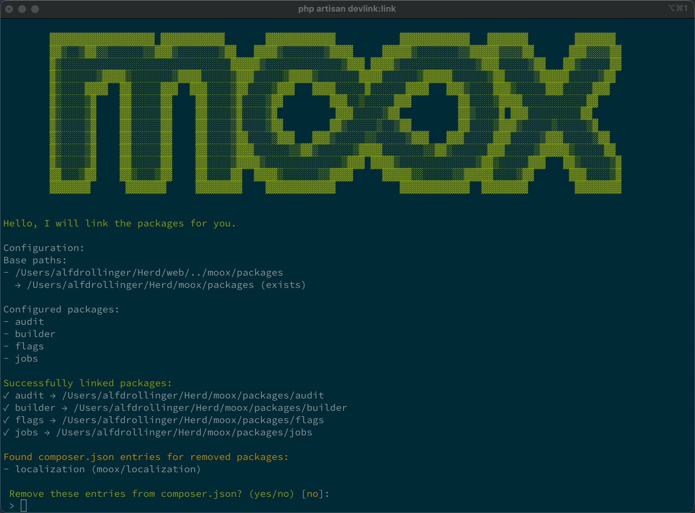
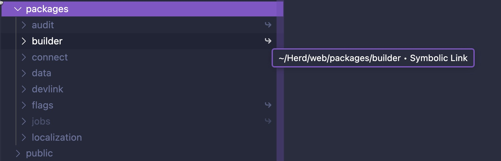

# Moox Devlink

Moox Devlink is used to link packages a monorepo into any project and to deploy a production-ready composer.json. That allows us to develop Moox packages in any project. It runs on MacOS and Linux, Windows with special configuration.

## Installation

```bash
composer require moox/devlink
php artisan vendor:publish --tag="devlink-config"
```

## Screenshot



## How It Works

1. Prepare your project's `.gitignore` file:

```bash

# Devlink
# ignore symlinks in packages/
packages/*
!packages/**/
!packages/*/.gitkeep
# and for windows
/packageslocal/*
# optional:
composer.json-deploy

```

2. Configure your paths and packages in the `config/devlink.php` file and change the package path in the `.env` file, if needed (Windows users should set the `DEVLINK_PACKAGES_PATH` variable to `packageslocal`).

3. When running `php init.php`

    - Creates a `.env` file from `.env.example`
    - Copies `composer.json-linked` to `composer.json`
    - Runs `composer update`

4. When running `devlink:status`:

    - Shows the configuration and status of each package
    - Shows the link status (Linked, Unlinked, Deployed)
    - Shows the update status (Up-to-date, Outdated)

5. When running `devlink:link`:

    - Creates the packages folder, if it does not exist
    - Creates symlinks for all configured packages
    - Updates composer.json with development configuration
    - Creates composer.json-linked for production use
    - Asks to run `composer install`
    - Asks to run `php artisan optimize:clear`
    - Asks to run `php artisan queue:restart`

6. When running `devlink:deploy`:

    - Removes all symlinks
    - Deletes the packages folder, if empty
    - Restores production-ready composer.json from composer.json-linked
    - Asks to run `composer install`
    - Asks to run `php artisan optimize:clear`
    - Asks to run `php artisan queue:restart`

7. CI Safety Net - `deploy.sh`:

    - If composer.json-linked exists in the repository:
        - Remove all symlinks from /packages
        - rename composer.json-linked to composer.json
    - Commit and push the change in your GitHub Action

Mac and Linux work out of the box. You can have local packages mixed with the symlinked packages in your `/packages` folder.



### Windows

On Windows there are most probably some issues with ignoring symlinks. If you run into issues, you can either globally or project-wise disable the symlinks or do the following:

```env
DEVLINK_PACKAGES_PATH=packageslocal
```

Devlink will then link the packages into the `packageslocal` folder instead of mixing them into packages.

## Classes

Please see the [CLASSES.md](./CLASSES.md) file for a quick class overview.

## Roadmap

Please see the [ROADMAP.md](./ROADMAP.md) file for what is planned.

## Changelog

Please see the [CHANGELOG.md](./CHANGELOG.md) file for what has changed.

## Security Vulnerabilities

Please review [our security policy](https://github.com/mooxphp/moox/security/policy) on how to report security vulnerabilities.

## Credits

-   [All Contributors](../../contributors)

## License

The MIT License (MIT). Please see [License File](LICENSE.md) for more information.
