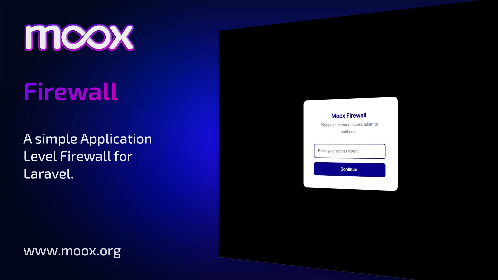
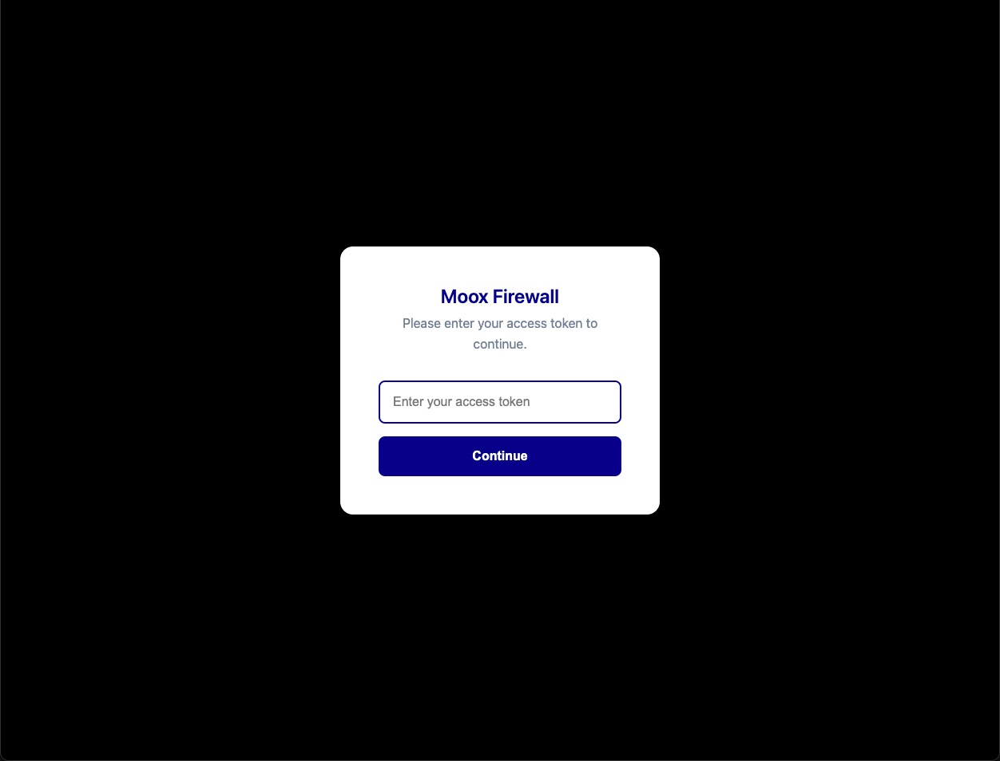

<div class="filament-hidden">



</div>

# Moox Firewall

<!-- description -->

Moox Firewall allows you to secure your Laravel application by restricting access to whitelisted IP addresses.

For maintenance or emergency access, you can enable a temporary backdoor using a secret access token.

Moox Firewall provides an additional security layer on top of your existing authentication mechanisms.
It strengthens access control but does not replace Multi-Factor Authentication (MFA) as defined by the BSI.

Support for MFA and modern Passkeys is planned for an upcoming release, see [Roadmap](ROADMAP.md) for more

<!-- /description -->

## Features

<!--features-->

-   Application level firewall
-   IP Whitelisting
-   Backdoor with Token

<!--/features-->

## Installation

```bash
composer require moox/firewall
```

and publish the config, to activate and adjust Moox Firewall:

```bash
php artisan vendor:publish --tag="firewall-config"
```

## Screenshot



## Configuration

You can configure all things in firewall.php:

```php
return [
    // Enable firewall?
    'enabled' => env('MOOX_FIREWALL_ENABLED', true),

    // Whitelist IP addresses
    'whitelist' => array_filter(explode(',', env('MOOX_FIREWALL_WHITELIST', ''))),

    // Logo to display on the firewall page
    'logo' => env('MOOX_FIREWALL_LOGO', 'img/logo.png'),

    // Backdoor allowed?
    'backdoor' => env('MOOX_FIREWALL_BACKDOOR', true),

    // Backdoor bypass token
    'backdoor_token' => env('MOOX_FIREWALL_BACKDOOR_TOKEN', 'let-me-in'),

    // Firewall page message
    'message' => env('MOOX_FIREWALL_MESSAGE', 'Moox Firewall'),

    // Firewall page color as hex
    'color' => env('MOOX_FIREWALL_COLOR', 'darkblue'),

    // Firewall page description
    'description' => env('MOOX_FIREWALL_DESCRIPTION', 'Please enter your access token to continue.'),
];
```

## Usage

1. After installation you need to global_enable the firewall
2. Set config values or use your environment to adjust it to your needs
3. Use the backdoor token to log in or append it to your URL like `?backdoor_token=let-me-in`

## Roadmap

See the [ROADMAP](ROADMAP.md) for more.

## Security

Please review [our security policy](https://github.com/mooxphp/moox/security/policy) on how to report security vulnerabilities.

## License

The MIT License (MIT). Please see [our license and copyright information](https://github.com/mooxphp/moox/blob/main/LICENSE.md) for more information.
