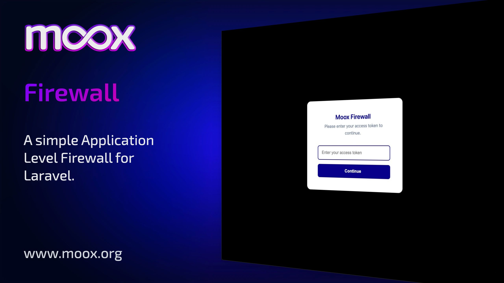

# Moox Firewall

Application-level access gate for Laravel and Filament. Blocks `web` (and optionally panel) traffic unless the client is whitelisted, has a valid unlock session, or passes the backdoor token challenge.

## Installation

```bash
composer require moox/firewall
```

Publish config and migrations, then migrate:

```bash
php artisan vendor:publish --provider="Moox\Firewall\FirewallServiceProvider" --tag=firewall-config
php artisan vendor:publish --provider="Moox\Firewall\FirewallServiceProvider" --tag=firewall-migrations
php artisan migrate
```

Set a strong backdoor token in production:

```env
MOOX_FIREWALL_ENABLED=true
MOOX_FIREWALL_BACKDOOR_TOKEN=your-long-random-token
```

## Filament panel setup

Register the plugin on panels that should use panel-level middleware and the whitelist resource:

```php
use Moox\Firewall\Plugins\FirewallPlugin;

$panel->plugins([
    // ...
    FirewallPlugin::make(),
]);
```

The package also pushes `EnsureFirewallAccess` onto Laravel's `web` middleware group automatically (see `FirewallServiceProvider`).

## How it works

- **Middleware** (`EnsureFirewallAccess`): primary enforcement path.
- **Plugin** (`FirewallPlugin`): attaches the same middleware to Filament panels and registers `FirewallWhitelistEntryResource` when `firewall.enabled` and `firewall.resource.enabled` are true.
- **Decision order** (simplified):
  - firewall disabled → allow
  - Livewire internal requests → allow
  - optional `protect` patterns: if set, only those routes are protected
  - `exclude` patterns → allow
  - config `whitelist` / DB whitelist entry → allow (optionally limited by `whitelist_allow` or per-entry routes)
  - valid unlock session (`firewall_authenticated_at` within TTL) → allow
  - backdoor disabled → 403 access denied
  - otherwise → inline challenge or redirect to `backdoor_url`, token verified on `POST`

## Key configuration

| Key | Env | Description |
|-----|-----|-------------|
| `enabled` | `MOOX_FIREWALL_ENABLED` | Master toggle (default: `false`) |
| `whitelist` | `MOOX_FIREWALL_WHITELIST` | Comma-separated IPs |
| `protect` | `MOOX_FIREWALL_PROTECT` | Comma-separated route patterns to protect (empty = all except exclude) |
| `exclude` | — | Route patterns always allowed (default includes `wilo/*`) |
| `whitelist_allow` | `MOOX_FIREWALL_WHITELIST_ALLOW` | Limit config whitelist bypass to patterns |
| `backdoor` | `MOOX_FIREWALL_BACKDOOR` | Enable token challenge |
| `backdoor_token` | `MOOX_FIREWALL_BACKDOOR_TOKEN` | Shared secret (required when backdoor enabled) |
| `backdoor_url` | `MOOX_FIREWALL_BACKDOOR_URL` | Challenge path (default `/backdoor`) |
| `inline_challenge` | `MOOX_FIREWALL_INLINE_CHALLENGE` | Show form on blocked URL vs redirect |
| `session_ttl_minutes` | `MOOX_FIREWALL_SESSION_TTL_MINUTES` | Unlock session lifetime |
| `backdoor_rate_limit` | `MOOX_FIREWALL_BACKDOOR_RATE_LIMIT` | Failed attempts per IP per minute |
| `resource.enabled` | `MOOX_FIREWALL_RESOURCE_ENABLED` | Filament whitelist CRUD |
| `legacy_listener.enabled` | `MOOX_FIREWALL_LEGACY_LISTENER_ENABLED` | Old `RouteMatched` listener (keep `false`) |

## Whitelist resource (Filament)

When enabled, manage per-IP rules:

- **Allow all protected routes** — full bypass for that IP
- **Allowed routes** — bypass only for matching patterns (`Request::is` style)

## Security notes

- Backdoor token is checked with `hash_equals` on `POST` (CSRF when using web middleware).
- Intended redirects after unlock are relative paths only (open-redirect hardening).
- Legacy `FirewallListener` remains for backward compatibility; keep `legacy_listener.enabled` disabled.

## Changelog

See [CHANGELOG](CHANGELOG.md).

## Security

Please review [our security policy](https://github.com/mooxphp/moox/security/policy) on how to report security vulnerabilities.

## License

The MIT License (MIT). Please see [LICENSE.md](LICENSE.md).
