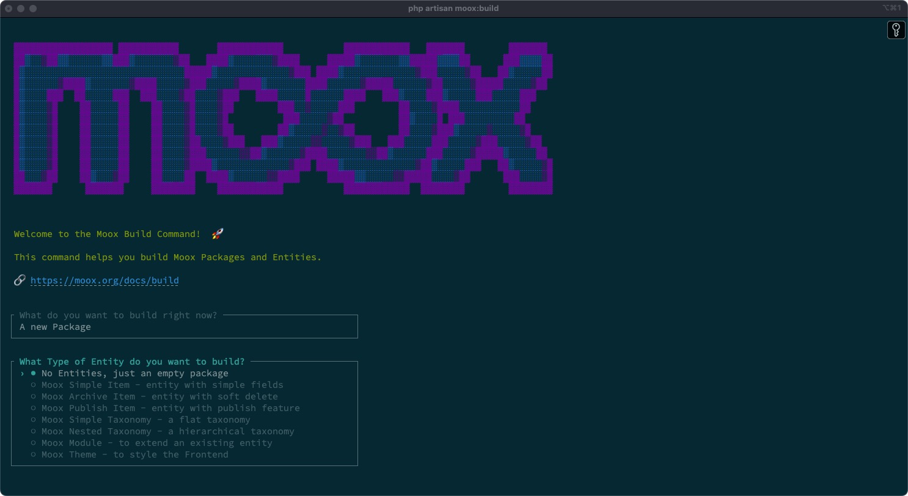

<div class="filament-hidden">


</div>

# Moox Skeleton

<!-- Description -->

This template is used for generating Laravel packages, all Moox packages are built with this template. Press the Template-Button in GitHub, create your own Laravel package.

<!-- /Description -->

The package is part of the **Moox ecosystem** — a suite of Filament packages that form a solid foundation for Laravel apps, websites, CMS, and eCommerce projects.

Learn more about [Moox](https://moox.org).

## Features

<!-- Features -->

-   Skeleton Package
-   Build Command

<!-- /Features -->

## Installation

To install this package, require it via Composer and run the Moox Installer:

```bash
composer require moox/skeleton
php artisan moox:install
```

Learn more about the [Moox Installer or common requirements](https://moox.org/docs/getting-started/installation).

## Screenshot



## Usage

<!-- Usage -->

The best way to use Moox Skeleton is by using the [Moox Build](https://github.com/mooxphp/build) command. Alternatively you can use the GitHub-template and the PHP-command that ships with the package.

```php
php build.php
```

<!-- /Usage -->

## Changelog

Please see [CHANGELOG](CHANGELOG.md) for more information on what has changed recently.

## Security

Please review [our security policy](https://github.com/mooxphp/moox/security/policy) on how to report security vulnerabilities.

## Credits

Thanks to so many [people for their contributions](https://github.com/mooxphp/moox#contributors) to Moox, special thanks to our sponsors.

## Help Moox

Want to help us to develop and grow Moox. Fortunately there are so many ways to do this, learn more about [helping Moox](https://moox.org/help-moox).

## License

The MIT License (MIT). Please see [our license and copyright information](https://github.com/mooxphp/moox/blob/main/LICENSE.md) for more information.
