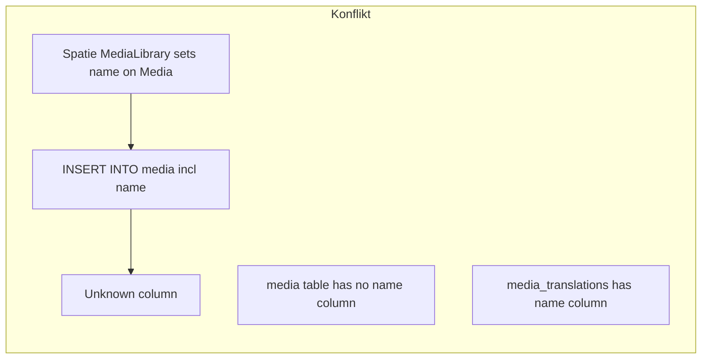

# Media-Upload: Spalte `name` vs. Translation-Schema

## Symptombild (gleicher Kern, unterschiedliche Oberfläche)

- **Upload in der Mediathek** ([`ListMedia`-Action](packages/media/src/Resources/MediaResource/Pages/ListMedia.php), „Media in Media selbst“, inkl. `exists = true`-Hack): Derselbe fehlerhafte INSERT führt zu einem **„harten“ Laravel-Fehler** (Error/Exception-Seite bzw. uncaught über den Livewire-Flow).
- **Upload angehängt an Category**: Derselbe SQL-Fehler wird **von der UI abgefangen** und als Filament-/App-Notification mit Text **„Error uploading file“** plus SQL-Body angezeigt (nutzerfreundlicher für dieses Formular).

Beide pflegen dieselbe Ursache (**`name` im INSERT ohne DB-Spalte**); nach dem Backend-Fix sollten **beide** ohne Fehler durchlaufen. Die **UX-Differenz** (Exception vs. Notification) bleibt nur relevant, falls außerhalb dieses konkreten SQL-Bugs weiterhin andere Upload-Fehler in der Mediathek nicht sauber gekapselt sind — siehe neue To-do unter Verifikation.

## Diagnose

- Der SQL zeigt einen INSERT auf `media` mit Spalte **`name`** (Wert aus dem Basisnamen „image”), obwohl in der Moox-Migration [`packages/media/database/migrations/create_media_table.php.stub`](packages/media/database/migrations/create_media_table.php.stub) diese Spalte **nicht existiert**.
- Über [`packages/media/database/migrations/create_media_translations_table.php.stub`](packages/media/database/migrations/create_media_translations_table.php.stub) liegt **`name`** in **`media_translations`**; entsprechend enthält [`packages/media/src/Models/Media.php`](packages/media/src/Models/Media.php) `$translatedAttributes = ['name', ...]` und **kein** `name` in `$fillable` auf der Haupttabelle.
- Beim Upload in [`packages/media/src/Resources/MediaResource/Pages/ListMedia.php`](packages/media/src/Resources/MediaResource/Pages/ListMedia.php) erfolgt `$fileAdder->...->toMediaCollection(...)` (**Spatie**). Die aktuelle Spatie-`Media`-Basisklasse (im Docblock dort) dokumentiert **`@property string $name`** und behandelt `name` wie ein normales Attribut bei der Persistierung; sobald **`name`** in `$this->attributes` landet (z. B. über interne Zuweisungen statt über den Translatable-Accessor), nimmt Laravel es in den INSERT für die Haupttabelle auf → **Unknown column `name`**.
- Eine eigene **`name`-Spalte auf `media` hinzuzufügen wäre mit Astrotomic unüblich und riskant:** übersetzte Attribute sollen dort **keine** echten Haupttabellen-Spalten sein (`name` würde dann kollidieren mit dem Translation-Verhalten von Astrotomic).

## Gewählter Fix

- Im Model [`Moox\Media\Models\Media`](packages/media/src/Models/Media.php) beim Ereignis **`creating`** sicherstellen, dass **`name` nicht Teil der zu persistierenden Haupt-Attributes** für die Tabelle `media` ist:
  - Wenn **`name`** in den internen `attributes` liegt, **vor dem INSERT entfernen** (z. B. `$media->offsetUnset('name')` oder zielgerichtetes Entfernen aus dem internen Attributes-Array, kompatibel mit der jeweiligen Laravel-Version).
- Die bestehende Logik in `ListMedia` **behält ihr Verhalten**, die Translation mit **vollständigem Dateinamen** wird direkt nach `toMediaCollection` noch gesetzt (Zeilen 288 ff.); dort entfällt keine funktionale Dopplung mit Spaties oft **basename ohne Endung**.
- Optional (nur falls nötig): dasselbe Muster beim **`updating`**-Event prüfen, falls später jemand `name` auf dem Parent setzt — meist nicht nötig, da `name` ohnehin über Translations geführt wird.

## Was ihr bei bestehenden DBs müsst

- **Keine DB-Migration nötig** für diese Korrektur: die Tabelle soll weiterhin ohne `media.name` bleiben.
- Nach Deploy nur Code aktualisieren; Upload erneut testen.

## Test / Verifikation

- Manuell: In der Filament-Oberfläche **Mediathek** „Upload“ durchspielen (erster erfolgreicher Save, Translation in **`media_translations`**).
- Manuell: **Category** weiter testen — Upload/Attach der Datei ebenfalls ohne **`Unknown column name`**.
- Falls die Mediathek bei zukünftigen Fehlern weiter „hart“ bricht: gezielt **gleiche Fehlerbehandlung** wie im Category-Formular (try/catch + `Notification::make()->danger()`) prüfen — nicht zwingend Teil des Minimal-Fixes, aber in der To-do `verify-both-upload-contexts-ux` adressiert.
- Optional: wenn ihr Tests ergänzt, einen Minimaltest mit `Media`-`creating`/`FileAdder` oder Schema wie die Stub-Migration gegen SQLite (aktuell gibt es in [`packages/media/tests/TestCase.php`](packages/media/tests/TestCase.php) kaum migrierten Test-Stub).

## Langfristig (nicht Teil dieses Minimal-Fix)

- Das Muster **`new Media; $model->exists = true` + Datei anlegen** ist ungewöhnlich; später könnte man auf einen **sauberen „Host“-Model** oder Spatie-Recommended-Flow migrieren, um Randeffekte mit Eloquent-Spatie zu reduzieren.
