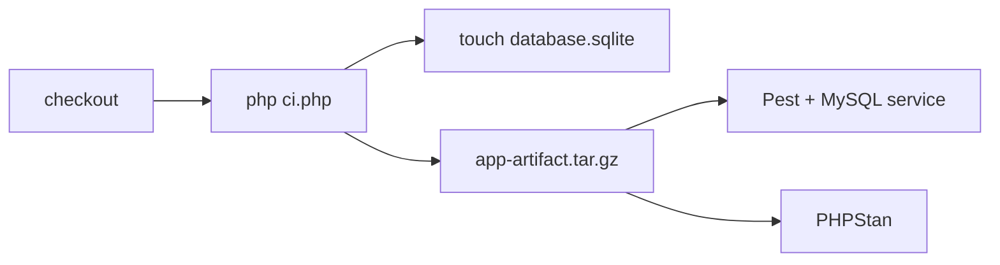
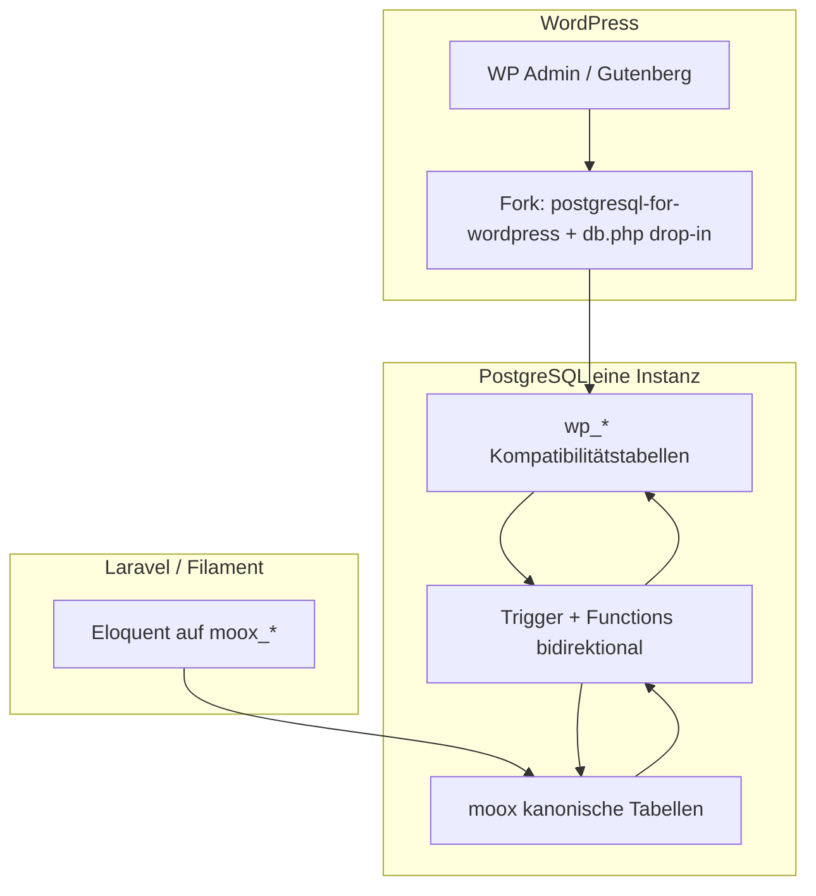
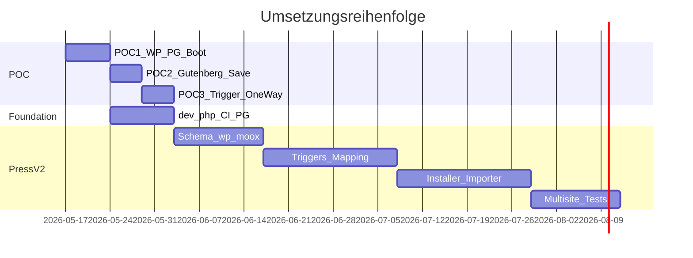

# Moox: dev.php, PostgreSQL und Press v2

## Ausgangslage (Ist)

### Dev/CI-Bootstrap

| Datei | Rolle | Status |
|-------|-------|--------|
| [`ci.php`](ci.php) | Laravel-Skeleton, Devlink-`composer.json`, `.env` aus Example, `composer update`, Artifact-`tar`, Sanity-Checks Pest/PHPStan | Produktiv in CI |
| [`dev.php`](dev.php) | Laravel-Skeleton nur (`--laravel=13`, `--delete`) | Unfertig (~50 %) |

**CI-Flow heute** ([`pest.yml`](.github/workflows/pest.yml), [`phpstan.yml`](.github/workflows/phpstan.yml)):



- Build-Job: MySQL irrelevant; `database.sqlite` ist Legacy (Pest nutzt MySQL-Service).
- Generierte App liegt in `.gitignore` ([`.gitignore`](.gitignore): `app/`, `composer.json`, `phpunit.xml`, …).
- Devlink: [`packages/devlink/config/devlink.php`](packages/devlink/config/devlink.php) steuert Path-Packages.

### Datenbank heute

- [`.env.example`](.env.example): `DB_CONNECTION=mysql`, Port 3306.
- Press: Eloquent-Models lesen **direkt** originale `wp_*`-Tabellen ([`WpBasePost`](packages/press/src/Models/WpBasePost.php) etc.) — **keine** kanonischen `moox_*`-Tabellen.
- [`moox-press.php`](packages/press/wordpress/plugins/moox-press/moox-press.php): hardcoded `mysql:`-PDO für Laravel-Sessions.
- [`UpdateWordPressURL`](packages/press/src/Commands/UpdateWordPressURL.php): MySQL-`REPLACE()` in Raw-SQL.
- [`JobStatsOverview`](packages/jobs/src/Resources/JobsResource/Widgets/JobStatsOverview.php): hat bereits `pgsql`-Branches; [`JobsWaitingOverview`](packages/jobs/src/Resources/JobsWaitingResource/Widgets/JobsWaitingOverview.php) noch MySQL-Datetime-Arithmetik.
- Docs: [Requirements](packages/docs/01 Getting Started/02 Requirements.md) nennen MySQL für Press.

### Entscheidungen (bestätigt)

- **Laravel 13** als Default in `dev.php` (wie aktueller Help-Text).
- **PostgreSQL als einzige DB** — kein MySQL, kein SQLite als Standard.
- **Press-Zielarchitektur**: Nutzer-Spezifikation (Trigger-Sync, wp_*-Adapter, kein Queue-Sync).

### Ist → Soll (konzeptionell)

| Heute | Press v2 |
|-------|----------|
| `WpBasePost` etc. lesen **direkt** `wp_*` auf MySQL | Filament/Laravel arbeiten auf **kanonischen** `moox_*` |
| Moox und WP teilen faktisch dasselbe Schema (WP-Tabellen) | **Adapter-Schicht**: echte `wp_*` nur für WordPress |
| Keine Trennung „canonical vs. compatibility“ | Trigger/Functions = einzige Brücke, synchron in PG |
| pgvector unmöglich ohne zweite DB | Vektoren in `moox_*`, Extension auf derselben PG-Instanz |

**Warum der Umbau nicht „nur DB_CONNECTION=pgsql“ ist:** WordPress erwartet MySQL-Dialekt und echte `wp_*`-Semantik. [postgresql-for-wordpress](https://github.com/PostgreSQL-For-Wordpress/postgresql-for-wordpress) übersetzt Queries, ersetzt aber nicht die Architektur-Entscheidung „moox besitzt die Wahrheit“. Dafür braucht es `moox_*` + Trigger.

**Empfehlung Topologie:** **Eine PostgreSQL-Datenbank** (`moox` + `wp_*` + `moox_*` + später `vector`). Zwei DBs würden Trigger/Sync und pgvector unnötig verkomplizieren. Multisite = `blog_id`/Prefix in derselben DB.

---

## Pflichtkomponenten (Checkliste aus Spezifikation)

- [ ] Besserer WordPress-Installer (`mooxpress:wpinstall` v2)
- [ ] WordPress-Multisite-Management für Astrotomic Translatable
- [ ] Fork `postgresql-for-wordpress` (WP aktuell, Composer, `db.php` drop-in)
- [ ] PostgreSQL-Schema-Installer für `wp_*`-Kompatibilitätstabellen
- [ ] Trigger/Functions bidirektional:
  - `moox_posts` ⇄ `wp_posts` + `wp_postmeta`
  - `moox_users` ⇄ `wp_users` + `wp_usermeta`
  - Media ⇄ `wp_posts` (attachment) + `wp_postmeta`
  - Taxonomies ⇄ `wp_terms`, `wp_term_taxonomy`, `wp_term_relationships`
- [ ] Mount/Mapping-System (posts, pages, CPTs, taxonomies, meta, media, translations)
- [ ] Übersetzungen: Astrotomic ⇄ WP Multisite (WPML ausgeschlossen; optional WPML-Migrationspfad)
- [ ] Tests: Existing-WP-Import **und** Fresh-WP-on-PG
- [ ] POC 1–3 vor Vollausbau

---

## Zielarchitektur Press v2



### Harte Constraints (aus Anforderung)

- WordPress sieht **nur** echte, WP-kompatible `wp_*`-Tabellen — **nie** Laravel/moox-Tabellen direkt.
- Sync **synchron** in PostgreSQL (Trigger/Functions), **kein** Queue, **kein** async Replication.
- **Eine** Datenbank-Engine: PostgreSQL (Laravel + WP + später pgvector).
- Kein doppeltes Admin-UI (Filament bleibt canonical für Moox-Daten; WP nur für WP-Ökosystem).

### Zwei Betriebsmodi

| Modus | Einstieg | Datenfluss |
|-------|----------|------------|
| **Existing WordPress** | MySQL-Dump / WP-Export | Importer → `wp_*` auf PG → Trigger → `moox_*` |
| **Fresh** | Moox-Migrationen / Filament | `moox_*` → Trigger → `wp_*` → WP bootet |

### Mapping-System (neu, explizit)

Konfiguration pro Entität (z. B. in `config/press.php` oder eigenes `press-mounts.php`):

- posts, pages, CPTs, custom taxonomies, meta/custom fields, media, translations
- Feldmapping: `moox_posts.slug` ↔ `wp_posts.post_name`, Meta ↔ `wp_postmeta`, etc.
- **Schutz vor Trigger-Loops**: Sync-Flag pro Session (`SET LOCAL app.syncing = true`) oder `BEFORE` trigger guards — Pflicht im Design, sonst Endlosschleifen bei bidirektionalem Sync.

### Übersetzungen

- **Ziel**: Astrotomic Translatable (moox) ↔ WordPress Multisite
- **Nicht**: WPML (optional später: Migrationspfad WPML → Multisite/Astrotomic, separater Track)
- Multisite-Installer/Management als eigenes Subsystem

### Alternative / Ergänzung: Isolated Gutenberg

Paralleler Research-Track (kein Blocker für POC 1–3):

| Option | Link | Bewertung für Moox |
|--------|------|-------------------|
| Isolated Block Editor | [Automattic/isolated-block-editor](https://github.com/Automattic/isolated-block-editor) | Nahe an WP-Gutenberg, weniger WP-Core |
| BlockNote | [blocknotejs.org](https://www.blocknotejs.org/) | Favorit UX; Nesting-Problem |
| Tiptap | [tiptap.dev](https://tiptap.dev/) | Dual-Lizenz wie BlockNote |
| TallCMS | [tallcms.com](https://tallcms.com/) | Filament-5-tauglich; Spike wert |
| Slate | [ianstormtaylor/slate](https://github.com/ianstormtaylor/slate) | Fallback ohne TipTap/BlockNote |

**Strategie:** Press v2 mit vollem WP (Admin, Users, Media, CPTs, Taxonomies) ist der **Hauptpfad**. Isolated Gutenberg deckt nur den Editor-Teil — sinnvoll als **zusätzlicher** Filament-Editor auf `moox_*`, nicht als Ersatz für pg4wp/`wp_*`, solange WP-Ökosystem genutzt wird.

### Design-Notizen (Trigger-Layer)

- **Loop-Guard Pflicht:** `SET LOCAL app.syncing = true` in beiden Richtungen; Trigger am Anfang prüfen und `RETURN`/`RETURN NULL`.
- **DELETE/TRASH:** `post_status=trash` und hard deletes explizit mappen (`ON DELETE` Trigger oder Soft-Delete in `moox_*`).
- **Fresh vs. Import:** Fresh = initial `moox_*` → Trigger befüllen `wp_*` → WP-Install; Import = `wp_*` zuerst → Trigger → `moox_*` (Trigger-Richtung beim ersten Fill dokumentieren).
- **Spalten-ID:** WP nutzt `wp_posts.ID` (Großschreibung in PG je nach Quoting); FK `moox_posts.wp_post_id` konsistent halten.
- **Meta-Explosion:** Gutenberg schreibt viele `wp_postmeta`-Keys — Mount-Registry braucht allowlist vs. pass-through.
- **pg4wp-Fork:** [unclemusclez/postgresql-for-wordpress](https://github.com/unclemusclez/postgresql-for-wordpress) und [Network-Forks](https://github.com/PostgreSQL-For-Wordpress/postgresql-for-wordpress/network) in POC 1 vergleichen; Ziel-Package z. B. `moox/pg4wp`.

### Referenzen PostgreSQL + WP

- [postgresql-for-wordpress](https://github.com/PostgreSQL-For-Wordpress/postgresql-for-wordpress)
- [unclemusclez Fork](https://github.com/unclemusclez/postgresql-for-wordpress)
- [WordPress Codex: Alternative Databases](https://codex.wordpress.org/Using_Alternative_Databases)
- [timmehosting: WP mit PostgreSQL](https://timmehosting.de/wordpress-mit-postgresql-installieren)
- Docker: [ntninja/wordpress-postgresql](https://hub.docker.com/r/ntninja/wordpress-postgresql)

---

## Abgrenzung: Was dieser Umbau **nicht** sofort ist

- Package-Testbench/phpunit-Templates pro Paket (gitignored) — **später**, wenn Monorepo-CI stabil auf PG läuft.
- Vollständige Entfernung aller MySQL-Referenzen in Docs/Backup/Jobs-SQL — **inkrementell** nach Press-POC.
- pgvector-Produktivnutzung — **nach** stabiler PG-Basis; Extension in CI/Dev vorbereiten (`CREATE EXTENSION vector`).

---

## Phase 0 — Proof of Concept (vor großem Umbau)

**Ziel**: Risiken von pg4wp + echten `wp_*` + Gutenberg + einem Trigger validieren.

| POC | Erfolgskriterium | Artefakt |
|-----|------------------|----------|
| **POC 1** | WP bootet auf PG mit Fork + `db.php` drop-in, echte `wp_*`-Schema | Minimal-Repo oder Branch `poc/pg-wp-boot` |
| **POC 2** | Gutenberg speichert Page (`wp_posts` + `wp_postmeta` sichtbar) | Manueller Test + optional Pest Feature-Test |
| **POC 3** | `AFTER INSERT/UPDATE` auf `wp_posts` → `moox_posts` (ein Richtungsschritt reicht für POC) | SQL-Migration + ein Model |

**Fork-Entscheidung** (Recherche in POC 1):

- Basis: [PostgreSQL-For-Wordpress/postgresql-for-wordpress](https://github.com/PostgreSQL-For-Wordpress/postgresql-for-wordpress)
- Vergleich: [unclemusclez/postgresql-for-wordpress](https://github.com/unclemusclez/postgresql-for-wordpress), Network-Forks
- Deliverables Fork: WP 6.5+/6.7+ Kompatibilität, Composer-Package (`moox/pg4wp` o.ä.), kontrolliertes `wp-content/db.php`-Deployment via [`InstallWordPress`](packages/press/src/Commands/InstallWordPress.php)

**Bekannte Code-Fallen für POC** (bereits im Repo):

```257:257:packages/press/wordpress/plugins/moox-press/moox-press.php
    $dsn = sprintf('mysql:host=%s;dbname=%s;charset=%s', $host, $db, $charset);
```

→ Muss driver-aware (`pgsql:`) oder Laravel-API statt Raw-PDO.

---

## Phase 1 — Foundation: `dev.php` + CI auf PostgreSQL

**Ziel**: Monorepo kann wieder lokal und in CI eine Laravel-13-Dev-App mit allen Devlink-Packages auf PostgreSQL bauen.

### `dev.php` fertigstellen (Logik aus `ci.php` portieren)

1. Skeleton (bereits vorhanden)
2. Devlink → dynamisches `composer.json` (aus [`devlink.php`](packages/devlink/config/devlink.php))
3. `.env` aus `.env.example`
4. `composer update` + Binary-Checks (Pest, PHPStan)
5. Optional: `app-artifact.tar.gz` für CI
6. CLI: `--laravel=13` (Default), `--delete`, `--help`
7. `ci.php` deprecaten/entfernen nach Umstellung

### Konfiguration

[`.env.example`](.env.example) anpassen:

```env
DB_CONNECTION=pgsql
DB_HOST=127.0.0.1
DB_PORT=5432
DB_DATABASE=moox
DB_USERNAME=moox
DB_PASSWORD=
```

### CI-Workflows

[`pest.yml`](.github/workflows/pest.yml):

- `php dev.php` statt `ci.php`
- `touch database.sqlite` **entfernen**
- MySQL-Service → **PostgreSQL** (`postgres:16`, Healthcheck, `pdo_pgsql`)
- Env: `DB_CONNECTION=pgsql`, `DB_PORT` aus Service-Mapping

[`phpstan.yml`](.github/workflows/phpstan.yml): gleiche Build-Anpassung (kein DB nötig, aber konsistenter Bootstrap).

[`README.md`](README.md): `ci.php` → `dev.php`, `migrate --database=sqlite` → PostgreSQL-Hinweis.

**Hinweis**: Press-/WP-Tests in Monorepo-Pest werden erst sinnvoll, wenn POC 1–3 oder Schema-Installer existieren — bis dahin können Press-Tests `@group press-pg` skippen oder in separatem Workflow laufen.

---

## Phase 2 — Press v2 Kernkomponenten

### 2a. PostgreSQL Schema: `wp_*` Kompatibilität

- Neues Package oder Press-Submodul: `Moox\Press\Database`
- Migrationen/Installer für minimales WP-Schema (Core-Tabellen aus WP-Referenz, nicht Laravel-Migrations für WP-Core duplizieren blind)
- Versionierung pro WP-Version (6.5+)

### 2b. Kanonische moox-Tabellen

Neue Tabellen (Namenskonvention festlegen, z. B. `moox_posts`, `moox_users`, …):

- Entkoppelt von Eloquent auf `wp_*` ([`WpBasePost`](packages/press/src/Models/WpBasePost.php) → später nur Adapter/Legacy)
- Filament Resources arbeiten auf `moox_*`
- Foreign Keys: `moox_posts.wp_post_id` ↔ `wp_posts.ID`

### 2c. Trigger/Function-Layer

- SQL in versionierten Migrations (`database/migrations/press/sync/…`)
- Pro Entity-Paar: `sync_wp_*_to_moox`, `sync_moox_*_to_wp`
- Loop-Prevention (siehe oben)
- Media: Attachments als `post_type=attachment` in `wp_posts` + Meta
- Taxonomies: `wp_terms`, `wp_term_taxonomy`, `wp_term_relationships` ↔ moox taxonomy tables

Beispiel aus Anforderung (Richtung wp → moox) als Startpunkt — bidirektional erst nach Loop-Guard.

### 2d. Mount/Mapping-Registry

```php
// Konzeptionell
'posts' => [
    'moox' => MooxPost::class,
    'wp_table' => 'wp_posts',
    'fields' => ['title' => 'post_title', ...],
    'meta' => [...],
],
```

- Installer liest Registry → erzeugt/aktualisiert Trigger dynamisch **oder** statisch generierte SQL pro Release
- CPTs und custom taxonomies als Config-Einträge

### 2e. WordPress Installer v2

Erweiterung/Ersatz von [`mooxpress:wpinstall`](packages/press/src/Commands/InstallWordPress.php):

- PG-Verbindung testen (`DB::connection()->getDriverName() === 'pgsql'`)
- Composer: WP Core + **Fork pg4wp** + dotenv
- `db.php` drop-in deployen und validieren
- WP-CLI / Core-Install gegen PG
- Optional: Branch Fresh vs. Import

### 2f. Importer (Existing WordPress)

- MySQL → PG Pipeline (nicht runtime-sync): `wp db export` / custom exporter
- Import in `wp_*` auf PostgreSQL
- Einmaliger Lauf Trigger-Population → `moox_*`
- Validierungs-Reports (Counts, checksums, broken meta)

### 2g. Multisite + Astrotomic

- WP Multisite Setup für Locales/Blogs
- Mapping-Tabelle: `locale` ↔ `blog_id` ↔ Astrotomic translation rows
- Filament-Forms: Translations schreiben moox → Trigger → richtige `wp_*` Blog-Context

### 2h. Tests (beide Modi)

| Suite | Inhalt |
|-------|--------|
| `FreshPressPostgresTest` | moox migrate → triggers → wp install → gutenberg save → assert moox |
| `ImportPressPostgresTest` | Fixture MySQL dump → import → assert parity |
| CI | Separater Job mit `services.postgres` + pg4wp; nicht im Standard-Pest bis POC grün |

---

## Phase 3 — Codebase-Audit (parallel zu Phase 2)

MySQL-spezifische Stellen systematisch ersetzen:

| Bereich | Datei/Pattern | Aktion |
|---------|---------------|--------|
| Press Plugin PDO | `moox-press.php` | `pgsql` DSN / Laravel |
| URL Update | `REPLACE()` | `regexp_replace` oder app-level |
| Jobs Widgets | Datetime `-` | wie `JobStatsOverview` vereinheitlichen |
| Backup/Restore | `mysqldump` | `pg_dump` / `psql` Jobs |
| Docs | Requirements, README, item/testing.md | PG als Standard |

---

## Phase 4 — pgvector (nach stabiler PG-Basis)

- Extension in Dev (Herd/Docker) + CI
- Kanonische Vektorspalten in `moox_*` (nicht in `wp_*`)
- WP-Plugins, die MySQL FULLTEXT erwarten, prüfen — ggf. nicht unterstützt

---

## Risiko-Register

| Risiko | Impact | Mitigation |
|--------|--------|------------|
| pg4wp/plugin-Inkompatibilität | WP-Plugins brechen | Fork pflegen; Plugin-Allowlist; POC 1+2 |
| Bidirektionale Trigger-Loops | Datenkorruption | `app.syncing` guard; einseitige Trigger in POC 3 |
| Gutenberg speichert unerwartete Meta | Mapping-Lücken | Mount-Registry + Tests pro CPT |
| Multisite-Komplexität | Falsche Blog-Zuordnung | Explizites locale↔blog_id Mapping |
| Monorepo-CI ohne WP | Press-Tests fehlen | Eigener Workflow nach POC |
| Importer Downtime | Migration riskant | Dry-run + checksum reports |

---

## Empfohlene Reihenfolge (Gesamt)



1. **POC 1–3** (kleiner Branch, wenig Monorepo-Risiko)
2. **dev.php + CI PostgreSQL** (parallel ab POC 1, entblockt Rest des Monorepos)
3. **Fork pg4wp + Installer v2**
4. **Schema + Trigger + Mapping**
5. **Importer + Multisite/Translations**
6. **pgvector**
7. **Gutenberg-isolated** (Research/Spike, optional)

---

## Architektur-Entscheidung: eine Datenbank

**Festgelegt für die Umsetzung:** eine PostgreSQL-Datenbank, drei Schichten (`wp_*` | Trigger | `moox_*`), eine `.env`-Connection. Begründung: bidirektionale Trigger, pgvector auf `moox_*`, kein Cross-DB-Sync.

---

## Nächster konkreter Schritt nach Plan-Freigabe

POC 1 in isoliertem Verzeichnis/Branch: Fork evaluieren, minimales `wp_*`-Schema, `db.php`, `mooxpress:wpinstall`-Prototyp — **ohne** noch `ci.php` zu löschen oder Press-Models umzubauen.
